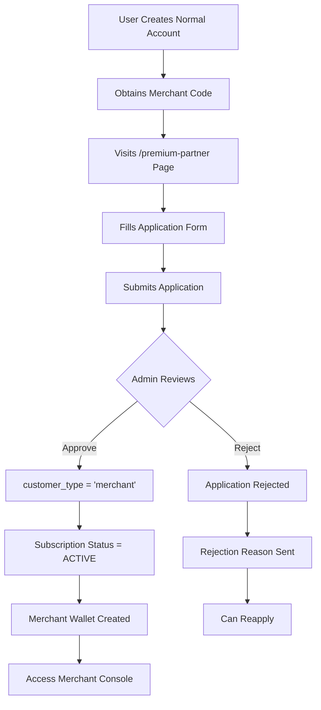
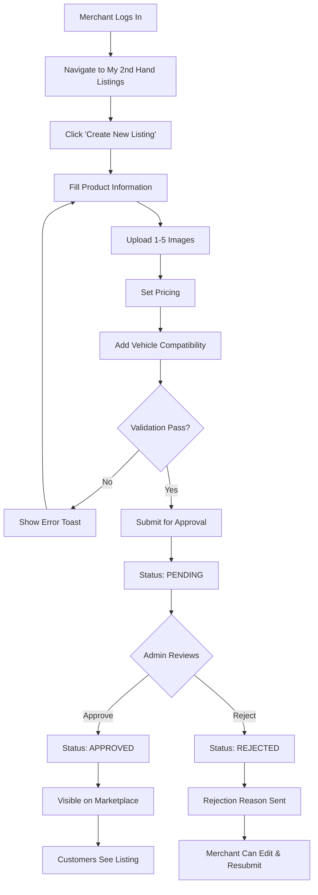
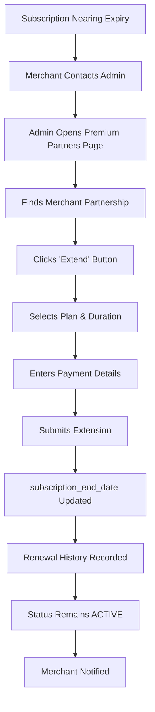

# AUTOLAB B2B MERCHANT PLATFORM - COMPREHENSIVE DOCUMENTATION

## Document Information
- **Version**: 1.0
- **Last Updated**: December 30, 2025
- **Platform**: AutoLab B2B Merchant Portal
- **Target Audience**: Business Partners, Workshops, Authorized Resellers

---

## TABLE OF CONTENTS

1. [System Overview](#1-system-overview)
2. [User Access & Authentication](#2-user-access--authentication)
3. [Subscription Plans](#3-subscription-plans)
4. [Merchant Console Overview](#4-merchant-console-overview)
5. [Complete Page Inventory](#5-complete-page-inventory)
6. [Detailed Page Documentation](#6-detailed-page-documentation)
7. [B2B Pricing System](#7-b2b-pricing-system)
8. [Business Profile Management](#8-business-profile-management)
9. [Analytics Dashboard](#9-analytics-dashboard)
10. [Installation Guides Library](#10-installation-guides-library)
11. [2nd Hand Marketplace](#11-2nd-hand-marketplace)
12. [Merchant Workflows](#12-merchant-workflows)
13. [Key Differences: B2B vs B2C](#13-key-differences-b2b-vs-b2c)
14. [Technical Details](#14-technical-details)
15. [Future Enhancements](#15-future-enhancements)

---

## 1. SYSTEM OVERVIEW

### 1.1 What is AutoLab B2B Merchant Platform?

The AutoLab B2B Merchant Platform is a specialized business portal designed for automotive workshops, authorized resellers, and panel shops. It provides wholesale pricing access, business management tools, installation resources, and marketplace features specifically tailored for professional merchants.

### 1.2 Core Features

#### For Professional (Merchant) Tier (RM99/year):
- **B2B Wholesale Pricing**: Access to merchant_price on all products (typically 20-30% lower than retail)
- **Analytics Dashboard**: Track shop listing views, direction clicks, call clicks
- **Installation Guides Library**: Video tutorials, pricing guides, installation instructions
- **2nd Hand Marketplace**: Sell used automotive parts to customers
- **RM50 Welcome Voucher**: Min. spend RM100 on first purchase
- **Merchant Console**: Centralized business management hub

#### For Panel (Premium Merchant) Tier (RM350/month):
- **Everything in Professional Tier**
- **Featured Listing**: Priority placement on Find Shops page
- **Authorized Panel Badge**: Official authorized dealer status
- **Priority Support**: Dedicated customer support
- **Advanced Analytics**: Enhanced performance metrics
- **Limited Availability**: Invitation-only, maximum 100 shops

### 1.3 Technology Stack

- **Frontend**: React 18 + TypeScript
- **UI Framework**: Tailwind CSS + shadcn/ui components
- **Backend**: Supabase (PostgreSQL + Auth + Storage)
- **Routing**: React Router v6
- **Icons**: Lucide React
- **Currency**: Malaysian Ringgit (MYR)

---

## 2. USER ACCESS & AUTHENTICATION

### 2.1 Account Registration

**Prerequisites**: Must have a merchant registration code to apply for partnership.

**Application Process**:
1. Customer creates normal account via `/auth` page
2. Submits merchant application via `/premium-partner` page (requires registration code)
3. Admin reviews application in Admin Panel > Premium Partners
4. Upon approval:
   - `customer_profiles.customer_type` changes from 'normal' to 'merchant'
   - Merchant wallet is automatically created (via database trigger)
   - Subscription becomes ACTIVE
   - Access to Merchant Console is granted

### 2.2 Authentication Flow

```
User Login (Supabase Auth)
  ↓
Check customer_type === 'merchant'?
  ↓ Yes
Fetch premium_partnerships data
  ↓
Verify subscription_status === 'ACTIVE' && admin_approved === true
  ↓ Yes
Grant access to Merchant Console
```

### 2.3 Access Requirements

| Feature | Required Status | Required Plan |
|---------|----------------|---------------|
| Merchant Console | customer_type = 'merchant' | Any |
| B2B Pricing | ACTIVE subscription | Professional/Panel |
| Analytics Dashboard | ACTIVE subscription | Professional/Panel |
| Installation Guides | ACTIVE + admin_approved | Professional/Panel |
| 2nd Hand Marketplace | customer_type = 'merchant' | Professional/Panel |
| Find Shops Listing | ACTIVE + Panel tier | Panel only |

---

## 3. SUBSCRIPTION PLANS

### 3.1 Professional (Merchant) Plan

**Price**: RM 99 per year

**Target Audience**: Small to medium workshops, independent resellers

**Features**:
- ✅ B2B Merchant Pricing access for all products
- ✅ Basic Analytics Dashboard
- ✅ Installation Guides Library with pricing
- ✅ RM50 Welcome Voucher (min. spend RM100)
- ✅ 2nd Hand Marketplace listing creation
- ✅ Business profile page
- ❌ Find Shops listing (Panel tier only)

**Billing**: Annual subscription (12 months)

**Renewal**: Manual renewal via admin

---

### 3.2 Panel (Premium Merchant) Plan

**Price**: RM 350 per month

**Target Audience**: Top 100 authorized shops across Malaysia

**Features**:
- ✅ Everything in Professional Plan
- ✅ **Featured listing on Find Shops page**
- ✅ **Authorized Panel Badge**
- ✅ Priority customer support
- ✅ Advanced Analytics Dashboard
- ⚠️ **Invitation-only - Limited to 100 shops**

**Billing**: Monthly subscription

**Renewal**: Manual renewal via admin

**Special Requirements**:
- Must follow AutoLab pricing and terms
- Admin invitation required
- Premium display priority

---

### 3.3 Subscription Status Indicators

| Status | Color | Description |
|--------|-------|-------------|
| ACTIVE (Approved) | Green | Full access to all features |
| PENDING (Not Approved) | Orange | Awaiting admin approval |
| SUSPENDED | Red | Temporarily disabled by admin |
| CANCELLED | Red | Application rejected or cancelled |
| EXPIRED | Gray | Subscription period ended |

---

## 4. MERCHANT CONSOLE OVERVIEW

**Route**: `/merchant-console`

**Access**: Requires `customer_type = 'merchant'`

### 4.1 Console Navigation

The Merchant Console features a sticky sub-navigation bar with 5 tabs:

```typescript
const navItems = [
  { id: 'dashboard', label: 'Dashboard', icon: LayoutDashboard },
  { id: 'profile', label: 'Business Profile', icon: Store },
  { id: 'marketplace', label: '2nd Hand Marketplace', icon: ShoppingCart },
  { id: 'subscription', label: 'Subscription', icon: CreditCard },
  { id: 'guides', label: 'Install Guides', icon: BookOpen, locked: !hasGuidesAccess }
];
```

**Status Indicator** (Top right):
- Green pulsing dot + "Active": Subscription is ACTIVE and admin_approved
- Orange pulsing dot + "Pending": Awaiting admin approval

---

## 5. COMPLETE PAGE INVENTORY

### 5.1 Merchant-Specific Pages

| Page Name | Route | Auth Required | Subscription Required |
|-----------|-------|---------------|----------------------|
| Merchant Console | `/merchant-console` | ✅ Merchant | ✅ Active |
| My 2nd Hand Listings | `/my-2ndhand-listings` | ✅ Merchant | ✅ Active |
| Premium Partner Application | `/premium-partner` | ✅ User | ❌ |

### 5.2 Shared Pages with B2B Pricing

Merchants see **merchant_price** instead of **normal_price** on:
- Catalog (`/catalog`)
- Product Details (`/product/:id`)
- Cart (`/cart`)
- Checkout flow

---

## 6. DETAILED PAGE DOCUMENTATION

---

## 6.1 MERCHANT CONSOLE - DASHBOARD TAB

**Purpose**: Central overview of merchant performance and business metrics.

### 6.1.1 UI Components

#### Header Section
- Title: "Overview"
- Subtitle: "{Business Name} - Performance metrics"
- Subscription plan badge (purple for Panel, lime for Professional)

#### Subscription Status Banners

**Pending Approval Banner** (if `admin_approved = false`):
```
[Orange Icon] Pending Admin Approval
Your subscription is being reviewed. Your shop will be visible once approved.
```

**Welcome Voucher Banner** (if Professional + approved):
```
[Gift Icon] Welcome Voucher Available!
RM50 voucher (min. spend RM100) for your next purchase.
```

---

#### Statistics Cards (Grid: 2 cols mobile, 4 cols desktop)

| Metric | Calculation | Display |
|--------|-------------|---------|
| **Listing Views** | `partnership.total_views` | Number + percentage change (e.g., "+12%") |
| **Direction Clicks** | `total_views * 0.15` | Number + percentage change |
| **Call Clicks** | `total_views * 0.05` | Number + percentage change |
| **Days Remaining** | `(subscription_end_date - now) / 86400000` | Number + "subscription" label |

Each card shows:
- Uppercase label (gray)
- Large bold value (black)
- Trend indicator with arrow (green up / red down)

---

#### Traffic Chart

**Type**: Bar chart (14-day view)

**Data Source**:
```typescript
// Simulated based on total_views
const weeklyData = Array.from({ length: 14 }, (_, i) => {
  const variance = Math.random() * 0.4 - 0.2;
  return Math.max(10, Math.floor((baseViews / 30) * (1 + variance)));
});
```

**Features**:
- Hover to show exact view count per day
- Bar color changes from gray to lime-600 on hover
- Time range toggle: 14D (active) / 30D (disabled)
- X-axis labels: "14 days ago" → "Today"

---

#### Business Summary Card

**Information Displayed**:
- Business Name
- Category (business_type)
- Location (city, state)
- Services (count of services_offered array)
- Photos (count of shop_photos array)

**Design**:
- Header: Gray background with bold title
- Content: White background with stacked fields
- Each field: Gray uppercase label + bold value

---

### 6.1.2 Data Sources

**Database Tables**:
- `premium_partnerships`: Main partnership data
- `customer_profiles`: User authentication

**Key Fields**:
```typescript
interface PartnershipData {
  id: string;
  merchant_id: string;
  business_name: string;
  business_type: string;
  subscription_plan: 'professional' | 'panel';
  subscription_status: 'PENDING' | 'ACTIVE' | 'SUSPENDED' | 'CANCELLED';
  subscription_end_date: string;
  admin_approved: boolean;
  total_views: number;
  city: string;
  state: string;
  services_offered: string[];
  shop_photos: string[];
}
```

---

### 6.1.3 Business Logic

**Days Remaining Calculation**:
```typescript
const getDaysRemaining = () => {
  if (!partnership?.subscription_end_date) return null;
  const endDate = new Date(partnership.subscription_end_date);
  const now = new Date();
  return Math.ceil((endDate.getTime() - now.getTime()) / (1000 * 60 * 60 * 24));
};
```

**Plan Badge Color Logic**:
- `panel` → Purple (bg-purple-100, text-purple-700)
- `professional` → Lime (bg-lime-100, text-lime-700)
- Default → Gray

---

## 6.2 MERCHANT CONSOLE - BUSINESS PROFILE TAB

**Purpose**: Manage public shop listing information visible on Find Shops page.

### 6.2.1 UI Components

#### Storefront Image Upload

**Design**:
- Aspect ratio: 4:3
- Border: Dashed when empty, solid when image exists
- Hover effect: Black overlay with "Upload New" text
- Upload indicator: Spinning loader with "Uploading..." text

**Upload Flow**:
1. User selects image file (accept="image/*")
2. File uploaded to Supabase Storage: `premium-partners/shop-photos/{partnership_id}-{timestamp}.{ext}`
3. Public URL generated
4. Added to `shop_photos` array (beginning of array)
5. Also set as `cover_image_url`
6. Database updated in `premium_partnerships` table

**Image Display**:
- Main image: First item in `shop_photos` array OR `cover_image_url`
- Gallery: Shows up to 4 thumbnails in grid (if more than 1 photo)

---

#### Branding Section (2-column grid on desktop)

**Left Column: Storefront Image**
- Upload area
- Gallery thumbnails (4x4 grid)

**Right Column: Basic Information**

| Field | Type | Validation | Database Column |
|-------|------|------------|-----------------|
| Shop Name | Text input | Required | `business_name` |
| Category | Select dropdown | Required | `business_type` |
| Introduction / Bio | Textarea (3 rows) | Optional | `description` |

**Category Options**:
- Auto Accessories Shop
- Performance Workshop
- Tinting Specialist
- Car Care Center
- Car Audio Specialist
- General Workshop

---

#### Contact & Location Section

**Grid Layout**: 2 columns on desktop

| Field | Type | Placeholder | Database Column |
|-------|------|-------------|-----------------|
| Phone Number | Tel input | "+60 12-345 6789" | `contact_phone` |
| Email Address | Email input | "shop@example.com" | `contact_email` |
| Full Address | Text input (span 2 cols) | "123, Jalan Example..." | `address` |
| City | Text input | "Kuala Lumpur" | `city` |
| State | Select dropdown | - | `state` |
| Postcode | Text input | "50000" | `postcode` |

**State Options** (16 states):
Johor, Kedah, Kelantan, Melaka, Negeri Sembilan, Pahang, Penang, Perak, Perlis, Sabah, Sarawak, Selangor, Terengganu, Kuala Lumpur, Labuan, Putrajaya

---

#### Services Offered Section

**Design**: Grid of checkboxes (2 cols mobile, 4 cols desktop)

**Available Services** (8 options):
1. Installation Service
2. Repair & Maintenance
3. Consultation
4. Product Sourcing
5. Warranty Service
6. Custom Orders
7. Delivery Available
8. Car Wash

**Checkbox Design**:
- Custom styled checkbox with green checkmark on selection
- Gray background, hover effect (border-lime-600)
- Uppercase bold label (10px)

**Storage**: Array of selected service names in `services_offered` column

---

### 6.2.2 Form Submission

**Save Button**:
- Location: Bottom right, above fold
- Style: Lime-600 background, white text, rounded-full
- Icon: Save icon (Lucide)
- Loading state: "Saving..." with disabled state

**Save Process**:
```typescript
const handleSave = async () => {
  const { error } = await supabase
    .from('premium_partnerships')
    .update({
      business_name: formData.business_name,
      business_type: formData.business_type,
      description: formData.description,
      contact_phone: formData.contact_phone,
      contact_email: formData.contact_email,
      address: formData.address,
      city: formData.city,
      state: formData.state,
      postcode: formData.postcode,
      services_offered: formData.services_offered,
      shop_photos: shopPhotos
    })
    .eq('id', partnership.id);

  toast({ title: 'Profile Updated', description: 'Your business profile has been saved successfully.' });
  onUpdate(); // Refresh partnership data
};
```

---

## 6.3 MERCHANT CONSOLE - SUBSCRIPTION TAB

**Purpose**: View current subscription details and understand plan benefits.

### 6.3.1 UI Components

#### Current Subscription Status Card

**Display Conditions**: Only shown if `currentPlan !== 'none'`

**Active Subscription** (Lime background):
```
Current Plan: PROFESSIONAL (or PANEL)
Active until {formatEndDate}
[Active Badge - Green]
```

**Pending Subscription** (Orange background):
```
Current Plan: PROFESSIONAL (or PANEL)
Pending admin approval
[Pending Badge - Orange]
```

---

#### Subscription Plan Cards

**Layout**: 2-column grid (stack on mobile)

---

##### PROFESSIONAL (MERCHANT) PLAN CARD

**Header**:
- Title: "Merchant"
- Subtitle: "Essential for all B2B merchant customers"
- Current Plan Badge (if applicable): Lime-600 badge

**Pricing**:
- Large: "RM 99"
- Small: "/year"

**Features List** (with check icons):
1. ✅ **B2B Merchant Pricing** access for all products
2. ✅ Basic **Analytics Dashboard**
3. ✅ **Installation Guides Library** with pricing
4. 🎁 **RM50 Welcome Voucher** (min. spend RM100)
5. ❌ Find Shops listing (Panel tier only) - Gray, strikethrough

**Button**:
- Disabled if current plan: "Current Plan - Active" (lime-100 bg)
- Enabled: "Subscribe Now" (lime-600 bg)
- Action: Opens toast with contact admin message

---

##### PANEL (PREMIUM MERCHANT) PLAN CARD

**Design**: Dark theme (bg-gray-900)
- Top gradient bar: Purple to lime gradient
- "Invitation Only" badge (purple) if not current plan
- "Current Plan" badge (lime) if active

**Header**:
- Title: "Panel (Authorized)"
- Subtitle: "Top 100 authorized shops across Malaysia"

**Pricing**:
- Large: "RM 350" (white text)
- Small: "/month"

**Features List**:
1. ✅ Everything in **Merchant**
2. ✅ **Featured listing on Find Shops** page (purple check, bold)
3. ✅ **Authorized Panel Badge** (purple check, bold)
4. ✅ Priority customer support
5. ✅ Advanced Analytics Dashboard
6. ⚠️ Admin invitation required - Limited to 100 shops (italic gray)

**Button**:
- Always disabled: "By Invitation Only" or "Current Plan - Active"
- Style: Purple-600/30 bg, purple-300 text

---

#### FAQ Section

**4 Accordion Items** (white cards, gray borders):

1. **How do I subscribe?**
   - Answer: Contact admin team via WhatsApp or email. Subscription activated within 24 hours after payment confirmation.

2. **What is the RM50 Welcome Voucher?**
   - Answer: Subscribed merchants receive RM50 voucher for purchases with min spend RM100.

3. **What are Installation Guides?**
   - Answer: Exclusive library of video tutorials, installation instructions, recommended pricing, and documentation for installing car accessories. Available to all Merchant subscribers (RM99/year).

4. **What is the Panel (Authorized) tier?**
   - Answer: Invitation-only (RM350/month) for top 100 authorized shops. Provides featured placement on Find Shops page with authorized badge. Must follow AutoLab pricing and terms.

---

### 6.3.2 Data Formatting

**Date Formatting**:
```typescript
const formatEndDate = () => {
  if (!partnership?.subscription_end_date) return 'N/A';
  return new Date(partnership.subscription_end_date).toLocaleDateString('en-MY', {
    year: 'numeric',
    month: 'long',
    day: 'numeric'
  });
};
// Output: "30 December 2025"
```

---

## 6.4 MERCHANT CONSOLE - INSTALLATION GUIDES TAB

**Purpose**: Access exclusive video tutorials and installation documentation for automotive parts.

**Access Requirement**:
```typescript
const hasGuidesAccess =
  (partnership?.subscription_plan === 'professional' || partnership?.subscription_plan === 'panel') &&
  partnership?.subscription_status === 'ACTIVE' &&
  partnership?.admin_approved;
```

If locked: Shows lock icon in tab, toast notification on click.

---

### 6.4.1 UI Components

#### Header Section

**Badge**: "Enterprise Feature" (purple-100 bg, purple-700 text)

**Title**: "Installation Library"

**Subtitle**: "Technical resources for authorized installers"

**Search Bar**:
- Placeholder: "Search guides..."
- Icon: Search (Lucide)
- Live filtering on title, car_model, car_brand

---

#### Brand Filter Tabs

**Design**: Horizontal scroll, pill-shaped buttons

**Data Source**: Extracted from guides (unique `car_brand` values)

**Default**: "All Brands" (shows all)

**Options**: All Brands, Toyota, Honda, Proton, Perodua, etc.

**Active State**: Lime-600 bg, white text

---

#### Video Grid

**Layout**: 3 columns desktop, 2 columns tablet, 1 column mobile

**Card Structure**:

##### Video Thumbnail Section
- Aspect ratio: 16:9
- Background: Dark overlay
- Play button icon (center, white with backdrop blur)
- Difficulty badge (top-left): Easy (green) / Medium (yellow) / Hard (orange/red)
- Duration badge (bottom-right): Shows `video_duration` (e.g., "15:30")
- Hover effect: Scale image 105%, darker overlay

##### Content Section
- Category badge with green dot indicator
- Title (bold, uppercase, 2-line clamp, hover turns lime-600)
- Divider line
- Car model info: "{car_brand} {car_model} ({year_start}-{year_end})"
- Watch link (opens video in new tab)
- Stats row:
  - Eye icon + view count
  - Clock icon + estimated time (minutes)

---

### 6.4.2 Guide Data Structure

```typescript
interface InstallationGuide {
  id: string;
  title: string;
  description: string;
  category: string; // Head Unit, Camera, Dashcam, Audio, etc.
  difficulty_level: 'Easy' | 'Medium' | 'Hard';
  car_brand: string;
  car_model: string;
  car_year_start: number;
  car_year_end: number;
  video_url: string; // YouTube URL
  thumbnail_url: string;
  video_duration: string; // e.g., "15:30"
  estimated_time_minutes: number;
  views_count: number;
  is_published: boolean;
  created_at: string;
}
```

---

### 6.4.3 Search & Filter Logic

```typescript
const filteredGuides = guides.filter(g => {
  const matchesSearch = g.title.toLowerCase().includes(search.toLowerCase()) ||
                        g.car_model?.toLowerCase().includes(search.toLowerCase()) ||
                        g.car_brand?.toLowerCase().includes(search.toLowerCase());
  const matchesBrand = selectedBrand === 'All Brands' || g.car_brand === selectedBrand;
  return matchesSearch && matchesBrand;
});
```

**Empty State**:
```
[BookOpen Icon - 48px, gray]
No guides found.
Try adjusting your search or filter criteria
```

---

### 6.4.4 Data Fetching

**Query**:
```typescript
const { data, error } = await supabase
  .from('installation_guides')
  .select('*')
  .eq('is_published', true)
  .order('created_at', { ascending: false });
```

**Note**: Only published guides are visible to merchants.

---

## 6.5 MERCHANT CONSOLE - 2ND HAND MARKETPLACE TAB

**Purpose**: Quick access redirect to dedicated marketplace management page.

**Behavior**: Automatically redirects to `/my-2ndhand-listings` using `useNavigate()`.

**Loading State**:
```
[ShoppingCart Icon - Animated pulse]
Redirecting to 2nd Hand Marketplace...
```

---

## 6.6 MY 2ND HAND LISTINGS PAGE

**Route**: `/my-2ndhand-listings`

**Access**: Requires `customer_type = 'merchant'`

**Purpose**: Create and manage secondhand automotive part listings for sale to customers.

---

### 6.6.1 Two-Tab Interface

**Tab 1**: My Listings ({count})
**Tab 2**: Create New Listing

**Tab Buttons**: Default shadcn/ui buttons with icons

---

### 6.6.2 MY LISTINGS TAB

#### Empty State
```
[Package Icon - 64px gray]
No listings yet
Create your first 2nd hand listing to start selling
[Create Listing Button]
```

---

#### Listing Cards (Grid: 3 cols desktop, 2 cols tablet, 1 col mobile)

**Card Structure**:

##### Image Section
- Aspect ratio: 16:9
- Background: Gray-100
- Image: First item from `images` array
- Fallback: Package icon if no images
- Status badge (top-right): Pending / Approved / Rejected / Sold / Expired

##### Content Section

**Title**: Bold, truncated, gray-900

**Description**: 2-line clamp, gray-500, small text

**Badges Row**:
- Condition badge (green for like_new, blue for good, yellow for fair, red for damaged)
- Category badge (outline, small text)

**Pricing**:
- Selling price: Large, bold, lime-600, "RM {price}"
- Original price (if set): Small, strikethrough, gray-400, "RM {price}"

**Stats Row** (gray-500, small):
- Eye icon + "{views_count} views"
- Package icon + "{inquiry_count} inquiries"

**Rejection Reason** (if status = rejected):
```
[Red-50 background, red-200 border, rounded]
Rejection Reason: {admin_notes}
```

**Action Buttons**:
- Edit button (outline, disabled)
- Delete button (outline, red text, disabled)

---

#### Listing Status Badges

| Status | Icon | Color | Text |
|--------|------|-------|------|
| pending | Clock | Yellow | Pending Review |
| approved | CheckCircle | Green | Approved |
| rejected | XCircle | Red | Rejected |
| sold | DollarSign | Purple | Sold |
| expired | Calendar | Gray | Expired |

---

#### Condition Badges

| Condition | Color | Text |
|-----------|-------|------|
| like_new | Green-100 / Green-800 | LIKE NEW |
| good | Blue-100 / Blue-800 | GOOD |
| fair | Yellow-100 / Yellow-800 | FAIR |
| damaged | Red-100 / Red-800 | DAMAGED |

---

### 6.6.3 CREATE LISTING TAB

**Form Layout**: White card with rounded corners, 6 sections

---

#### SECTION 1: Product Information

**Fields** (2-column grid):

| Field | Type | Validation | Max Length | Required | Database Column |
|-------|------|------------|------------|----------|-----------------|
| Title | Text input | Non-empty | 100 chars | ✅ | `title` |
| Description | Textarea (4 rows) | - | - | ❌ | `description` |
| Category | Select dropdown | Non-empty | - | ✅ | `product_category` |
| Condition | Select dropdown | Non-empty | - | ✅ | `condition` |

**Product Categories** (10 options):
- Android Head Unit
- Display Screen
- Camera System
- Audio System
- Navigation Device
- Dash Cam
- Car Accessories
- Interior Parts
- Exterior Parts
- Other

**Condition Options** (4 options with descriptions):

| Value | Label | Description |
|-------|-------|-------------|
| like_new | Like New | Barely used, excellent condition |
| good | Good | Used but well-maintained |
| fair | Fair | Shows signs of wear |
| damaged | Damaged | Has defects or damage |

---

#### SECTION 2: Pricing

**Fields** (3-column grid):

| Field | Type | Step | Placeholder | Required | Database Column |
|-------|------|------|-------------|----------|-----------------|
| Original Price (RM) | Number input | 0.01 | "e.g., 1500.00" | ❌ | `original_price` |
| Selling Price (RM) | Number input | 0.01 | "e.g., 800.00" | ✅ | `selling_price` |
| Price negotiable | Checkbox | - | - | ❌ | `is_negotiable` |

**Validation**: Selling price must be > 0

---

#### SECTION 3: Usage History

**Fields** (2-column grid):

| Field | Type | Min | Max | Placeholder | Database Column |
|-------|------|-----|-----|-------------|-----------------|
| Year Purchased | Number input | 2000 | Current year | "e.g., 2022" | `year_purchased` |
| Months Used | Number input | 0 | - | "e.g., 18" | `months_used` |
| Reason for Selling | Textarea (2 rows) | - | - | "e.g., Upgrading to newer model..." | `reason_for_selling` |

---

#### SECTION 4: Vehicle Compatibility

**Fields** (3-column grid):

| Field | Type | Placeholder | Database Column |
|-------|------|-------------|-----------------|
| Car Brand | Text input | "e.g., BMW" | `car_brand` |
| Car Model | Text input | "e.g., 3 Series" | `car_model` |
| Compatible Years | Text input | "e.g., 2015-2020" | `compatible_years` |

---

#### SECTION 5: Product Images

**Upload Requirements**:
- Minimum: 1 image
- Maximum: 5 images
- Accepted formats: image/*
- Storage location: `product-images/secondhand/{merchantProfileId}/{random}-{timestamp}.{ext}`

**Upload Area Design**:
- Dashed border (gray-300)
- Hover: Lime-500 border + lime-50 background
- Upload icon (48px gray)
- Text: "Click to upload images" (or "Uploading..." during upload)
- Counter: "{uploadedImages.length}/5 images uploaded"

**Image Preview Grid** (2 cols mobile, 5 cols desktop):
- Each image: Square aspect ratio, rounded corners, gray-200 border
- Remove button: Red circle (top-right) with X icon

**Upload Process**:
```typescript
1. User selects files
2. Check: uploadedImages.length + files.length <= 5
3. Upload each file to Supabase Storage
4. Generate public URLs
5. Add URLs to uploadedImages state array
6. Show success toast
```

---

#### SECTION 6: Submit

**Footer** (border-top):
- Left: Help text: "* Required fields. Your listing will be reviewed by admin before publication."
- Right: Submit button

**Submit Button**:
- Text: "Submit for Approval"
- Size: Large
- Disabled states: loading || uploading
- Loading text: "Submitting..."

---

### 6.6.4 Form Submission Process

**Validation Checks** (in order):
1. Title not empty → Toast error if fails
2. Category selected → Toast error if fails
3. Selling price > 0 → Toast error if fails
4. Condition selected → Toast error if fails
5. At least 1 image uploaded → Toast error if fails

**Database Insert**:
```typescript
const { error } = await supabase
  .from('secondhand_listings')
  .insert({
    seller_id: merchantProfileId,
    title: formData.title,
    description: formData.description,
    product_category: formData.product_category,
    original_price: formData.original_price ? parseFloat(formData.original_price) : null,
    selling_price: parseFloat(formData.selling_price),
    is_negotiable: formData.is_negotiable,
    condition: formData.condition,
    year_purchased: formData.year_purchased ? parseInt(formData.year_purchased) : null,
    months_used: formData.months_used ? parseInt(formData.months_used) : null,
    reason_for_selling: formData.reason_for_selling,
    car_brand: formData.car_brand,
    car_model: formData.car_model,
    compatible_years: formData.compatible_years,
    images: uploadedImages,
    status: 'pending' // Always starts as pending
  });
```

**Success Actions**:
1. Show success toast: "Listing submitted for admin approval. You will be notified once approved."
2. Reset form to empty state
3. Clear uploaded images
4. Refresh listings from database
5. Switch to "My Listings" tab

---

## 7. B2B PRICING SYSTEM

### 7.1 Pricing Context

**File**: `src/hooks/usePricing.tsx`

**Purpose**: Provide pricing context that automatically shows merchant_price for merchants and normal_price for regular customers.

```typescript
export const PricingProvider = ({ children }) => {
  const { user } = useAuth();
  const [isMerchant, setIsMerchant] = useState(false);

  useEffect(() => {
    const checkMerchantStatus = async () => {
      if (user) {
        const { data } = await supabase
          .from('customer_profiles')
          .select('customer_type')
          .eq('user_id', user.id)
          .single();

        setIsMerchant(data?.customer_type === 'merchant');
      }
    };
    checkMerchantStatus();
  }, [user]);

  const getDisplayPrice = (normalPrice: number, merchantPrice?: number) => {
    return isMerchant && merchantPrice ? merchantPrice : normalPrice;
  };

  return (
    <PricingContext.Provider value={{ isMerchant, getDisplayPrice }}>
      {children}
    </PricingContext.Provider>
  );
};
```

---

### 7.2 Price Display Logic

**Example Usage in Product Card**:
```typescript
const { getDisplayPrice, isMerchant } = usePricing();
const displayPrice = getDisplayPrice(product.normal_price, product.merchant_price);

// Display
<div className="price">
  RM {displayPrice.toFixed(2)}
  {isMerchant && <Badge>B2B Price</Badge>}
</div>
```

**Typical Price Differences**:
- Normal Price: RM 150.00
- Merchant Price: RM 120.00 (20% discount)

---

### 7.3 Database Schema

**Table**: `component_library` or `products_new`

**Columns**:
- `normal_price` DECIMAL(10,2) - Retail price for B2C customers
- `merchant_price` DECIMAL(10,2) - Wholesale price for B2B merchants (nullable)
- `cost_price` DECIMAL(10,2) - Internal cost (not shown to customers)

**Row Example**:
| Product Name | cost_price | merchant_price | normal_price |
|--------------|------------|----------------|--------------|
| Android Head Unit 12.3" | 450.00 | 650.00 | 850.00 |

---

## 8. BUSINESS PROFILE MANAGEMENT

### 8.1 Public Profile Display

**Where Visible**: Find Shops page (`/find-shops`)

**Access**: Panel tier merchants only (subscription_plan = 'panel')

**Display Priority**: `display_priority` column (higher = shown first)

### 8.2 Profile Components

**Listing Card Shows**:
- Cover image (`cover_image_url` or first `shop_photos` item)
- Business name with featured crown icon if `is_featured = true`
- Business type badge
- City, State with map pin icon
- Services offered (badges)
- Contact phone with call button
- "View Details" button

**Detail View Shows**:
- Full gallery of `shop_photos` (carousel)
- Complete description
- Full address with Google Maps integration
- Email address
- Operating hours (if implemented)
- Customer reviews (if implemented)

---

## 9. ANALYTICS DASHBOARD

### 9.1 Metrics Tracked

**Database Fields**:
- `total_views` INTEGER - Total listing page views
- `total_clicks` INTEGER - Click interactions
- `total_inquiries` INTEGER - Customer inquiry count

**Derived Metrics** (Dashboard Tab):
- Direction Clicks: `total_views * 0.15`
- Call Clicks: `total_views * 0.05`
- Weekly Views: Simulated daily breakdown

### 9.2 Traffic Chart

**Data Simulation**:
```typescript
const weeklyData = Array.from({ length: 14 }, (_, i) => {
  const variance = Math.random() * 0.4 - 0.2; // ±20% variance
  return Math.max(10, Math.floor((baseViews / 30) * (1 + variance)));
});
```

**Visual Design**:
- 14 vertical bars
- Height proportional to views (max height = 100%)
- Hover shows exact count in tooltip
- Gray default, lime-600 on hover

---

## 10. INSTALLATION GUIDES LIBRARY

### 10.1 Content Types

**Categories**:
- Head Unit
- Camera
- Dashcam
- Audio
- Sensors
- Lighting
- Security
- Performance
- Other

### 10.2 Guide Information

**Each Guide Contains**:
- Installation video (YouTube embedded)
- Step-by-step instructions
- Required tools list
- Estimated installation time
- Difficulty level (Easy/Medium/Hard)
- Compatible car models
- Recommended retail pricing (for merchants to charge customers)
- Safety warnings

### 10.3 Access Control

**Locked State** (if no access):
- Tab shows lock icon
- Click shows toast: "Subscription Required - Installation Guides are available with Merchant subscription (RM99/year)."

**Unlocked State** (has access):
- Full video library
- Search and filter by brand
- Click to watch videos in new tab
- View count tracking

---

## 11. 2ND HAND MARKETPLACE

### 11.1 Marketplace Flow

```
Merchant creates listing → Status: PENDING
  ↓
Admin reviews in Secondhand Moderation page
  ↓
Approve → Status: APPROVED (visible on marketplace)
  OR
Reject → Status: REJECTED (reason stored in admin_notes)
  ↓
Customer browses marketplace, contacts merchant
  ↓
Merchant marks as SOLD manually (future feature)
```

### 11.2 Listing Lifecycle

**Status Transitions**:
- `pending` → `approved` (admin approves)
- `pending` → `rejected` (admin rejects with reason)
- `approved` → `sold` (merchant marks sold - future)
- Any → `expired` (auto-expire after X days - future)

### 11.3 Customer Interaction

**Customer View** (`/secondhand-marketplace`):
- Grid of approved listings
- Filter by category, condition, price range
- Search by keyword
- Click listing to view details
- Contact merchant button (WhatsApp/Phone)

**Inquiry Tracking**:
- `inquiry_count` increments when customer clicks contact
- Merchant sees count in "My Listings" tab

---

## 12. MERCHANT WORKFLOWS

### 12.1 WORKFLOW: New Merchant Onboarding



**Steps**:
1. Customer creates account via `/auth`
2. Obtains merchant registration code (from AutoLab sales team)
3. Navigates to `/premium-partner`
4. Fills out business information form
5. Submits application (status = PENDING)
6. Admin reviews in Premium Partners page
7. **If Approved**:
   - `admin_approved = true`
   - `subscription_status = 'ACTIVE'`
   - `customer_profiles.customer_type = 'merchant'`
   - Merchant wallet auto-created (database trigger)
   - RM50 welcome voucher generated
8. **If Rejected**:
   - `subscription_status = 'CANCELLED'`
   - `rejection_reason` stored
   - Merchant notified

---

### 12.2 WORKFLOW: Creating a 2nd Hand Listing



**Validation Rules**:
- Title: Required, max 100 chars
- Category: Required
- Selling Price: Required, > 0
- Condition: Required
- Images: Minimum 1, maximum 5

---

### 12.3 WORKFLOW: Subscription Renewal



**Admin Actions**:
- Select plan (Professional RM99/year or Panel RM350/month)
- Choose duration (12 or 24 months)
- Enter payment amount, method, reference
- Add admin notes
- Submit extension

**System Updates**:
- Calculates new `subscription_end_date` (from current end date or today)
- Sets `next_billing_date`
- Logs entry in `partnership_renewal_history` table
- Updates `subscription_status = 'ACTIVE'`

---

## 13. KEY DIFFERENCES: B2B VS B2C

### 13.1 Access & Features

| Feature | B2C Customer | B2B Merchant (Professional) | B2B Merchant (Panel) |
|---------|--------------|---------------------------|---------------------|
| **Account Type** | Normal | Merchant | Merchant |
| **Subscription** | Not required | RM 99/year | RM 350/month |
| **Product Pricing** | normal_price | merchant_price (20-30% lower) | merchant_price |
| **Catalog Access** | ✅ | ✅ | ✅ |
| **Cart & Checkout** | ✅ | ✅ | ✅ |
| **Merchant Console** | ❌ | ✅ | ✅ |
| **Analytics Dashboard** | ❌ | ✅ Basic | ✅ Advanced |
| **Installation Guides** | ❌ | ✅ Full Library | ✅ Full Library |
| **2nd Hand Marketplace** | Browse only | Create listings | Create listings |
| **Find Shops Listing** | ❌ | ❌ | ✅ Featured |
| **Welcome Voucher** | ❌ | RM50 (min RM100) | RM50 (min RM100) |
| **Priority Support** | ❌ | ❌ | ✅ |
| **Authorized Badge** | ❌ | ❌ | ✅ Panel Badge |

---

### 13.2 Pricing Display

**B2C Customer Sees**:
```
Product: Android Head Unit 12.3"
Price: RM 850.00
```

**B2B Merchant Sees**:
```
Product: Android Head Unit 12.3"
Price: RM 650.00 [B2B Price Badge]
(Save RM 200.00 vs retail)
```

---

### 13.3 Navigation Differences

**B2C Customer Navigation**:
- Home
- Catalog
- Find Shops
- Secondhand Marketplace
- Cart
- My Orders
- Profile

**B2B Merchant Navigation** (Additional):
- **Merchant Console** (exclusive)
  - Dashboard
  - Business Profile
  - Subscription
  - Installation Guides
- **My 2nd Hand Listings** (exclusive)

---

### 13.4 Order Workflow Differences

**B2C**:
1. Browse catalog at retail prices
2. Add to cart
3. Checkout
4. Order delivered

**B2B**:
1. Browse catalog at **wholesale prices**
2. Add to cart (merchant_price applied)
3. Checkout (can use welcome voucher)
4. Order delivered
5. Track performance in **Analytics Dashboard**

---

### 13.5 User Experience Differences

**Visual Indicators for Merchants**:
- "B2B Price" badge on product cards
- Green "Merchant" badge in profile
- Merchant Console access in header
- Status indicator (Active/Pending) in console
- Subscription expiry warnings

**Business Tools for Merchants**:
- Business profile editor
- Shop listing visibility on Find Shops
- Installation guides library
- 2nd hand marketplace management
- Performance analytics
- Renewal history tracking

---

## 14. TECHNICAL DETAILS

### 14.1 Database Tables

#### `customer_profiles`
```sql
customer_profiles (
  id UUID PRIMARY KEY,
  user_id UUID REFERENCES auth.users,
  customer_type TEXT DEFAULT 'normal', -- 'normal' | 'merchant'
  full_name TEXT,
  phone TEXT,
  address TEXT,
  created_at TIMESTAMP,
  updated_at TIMESTAMP
)
```

#### `premium_partnerships`
```sql
premium_partnerships (
  id UUID PRIMARY KEY,
  merchant_id UUID REFERENCES customer_profiles(id),
  business_name TEXT,
  business_type TEXT,
  contact_phone TEXT,
  contact_email TEXT,
  address TEXT,
  city TEXT,
  state TEXT,
  postcode TEXT,
  description TEXT,
  services_offered TEXT[], -- Array of service names
  subscription_plan TEXT, -- 'professional' | 'panel'
  subscription_status TEXT, -- 'PENDING' | 'ACTIVE' | 'SUSPENDED' | 'CANCELLED' | 'EXPIRED'
  subscription_start_date TIMESTAMP,
  subscription_end_date TIMESTAMP,
  next_billing_date TIMESTAMP,
  yearly_fee DECIMAL(10,2),
  billing_cycle TEXT, -- 'year' | 'month'
  admin_approved BOOLEAN DEFAULT false,
  rejection_reason TEXT,
  is_featured BOOLEAN DEFAULT false,
  display_priority INTEGER DEFAULT 0,
  logo_url TEXT,
  cover_image_url TEXT,
  shop_photos TEXT[], -- Array of image URLs
  total_views INTEGER DEFAULT 0,
  total_clicks INTEGER DEFAULT 0,
  total_inquiries INTEGER DEFAULT 0,
  created_at TIMESTAMP DEFAULT NOW(),
  updated_at TIMESTAMP DEFAULT NOW()
)
```

#### `secondhand_listings`
```sql
secondhand_listings (
  id UUID PRIMARY KEY,
  seller_id UUID REFERENCES customer_profiles(id),
  title TEXT NOT NULL,
  description TEXT,
  product_category TEXT,
  original_price DECIMAL(10,2),
  selling_price DECIMAL(10,2) NOT NULL,
  is_negotiable BOOLEAN DEFAULT false,
  condition TEXT, -- 'like_new' | 'good' | 'fair' | 'damaged'
  year_purchased INTEGER,
  months_used INTEGER,
  reason_for_selling TEXT,
  car_brand TEXT,
  car_model TEXT,
  compatible_years TEXT,
  images TEXT[], -- Array of image URLs (max 5)
  status TEXT DEFAULT 'pending', -- 'pending' | 'approved' | 'rejected' | 'sold' | 'expired'
  admin_notes TEXT, -- Rejection reason
  reviewed_by UUID,
  reviewed_at TIMESTAMP,
  views_count INTEGER DEFAULT 0,
  inquiry_count INTEGER DEFAULT 0,
  created_at TIMESTAMP DEFAULT NOW(),
  updated_at TIMESTAMP DEFAULT NOW()
)
```

#### `installation_guides`
```sql
installation_guides (
  id UUID PRIMARY KEY,
  title TEXT NOT NULL,
  description TEXT,
  category TEXT,
  difficulty_level TEXT, -- 'Easy' | 'Medium' | 'Hard'
  car_brand TEXT,
  car_model TEXT,
  car_year_start INTEGER,
  car_year_end INTEGER,
  video_url TEXT NOT NULL,
  thumbnail_url TEXT,
  video_duration TEXT,
  estimated_time_minutes INTEGER,
  views_count INTEGER DEFAULT 0,
  is_published BOOLEAN DEFAULT false,
  created_at TIMESTAMP DEFAULT NOW()
)
```

#### `partnership_renewal_history`
```sql
partnership_renewal_history (
  id UUID PRIMARY KEY,
  partnership_id UUID REFERENCES premium_partnerships(id),
  renewal_type TEXT, -- 'NEW' | 'RENEWAL' | 'EXTENSION'
  previous_end_date TIMESTAMP,
  new_end_date TIMESTAMP,
  months_extended INTEGER,
  amount_paid DECIMAL(10,2),
  payment_method TEXT,
  payment_reference TEXT,
  previous_status TEXT,
  new_status TEXT,
  admin_notes TEXT,
  created_at TIMESTAMP DEFAULT NOW()
)
```

---

### 14.2 Supabase Storage Buckets

#### `premium-partners`
**Purpose**: Store merchant shop photos and logos

**Structure**:
```
premium-partners/
  shop-photos/
    {partnership_id}-{timestamp}.jpg
    {partnership_id}-{timestamp}.png
  logos/
    {partnership_id}-logo.png
```

**Access**: Public read, authenticated write (merchants only)

---

#### `product-images`
**Purpose**: Store secondhand listing images

**Structure**:
```
product-images/
  secondhand/
    {merchant_profile_id}/
      {random}-{timestamp}.jpg
      {random}-{timestamp}.png
```

**Access**: Public read, authenticated write (merchants only)

---

### 14.3 Key React Hooks

#### `useAuth()`
```typescript
const { user, signOut } = useAuth();
// Returns current authenticated user from Supabase Auth
```

#### `usePricing()`
```typescript
const { isMerchant, getDisplayPrice } = usePricing();
const displayPrice = getDisplayPrice(normalPrice, merchantPrice);
// Returns appropriate price based on customer type
```

#### `useToast()`
```typescript
const { toast } = useToast();
toast({
  title: 'Success',
  description: 'Profile updated successfully.',
  variant: 'default' | 'destructive'
});
```

---

### 14.4 Environment Variables

```env
VITE_SUPABASE_URL=https://your-project.supabase.co
VITE_SUPABASE_ANON_KEY=your-anon-key
```

---

### 14.5 Routing Structure

```typescript
// Main routes
/merchant-console         → MerchantConsole.tsx
/my-2ndhand-listings      → My2ndHandListings.tsx
/premium-partner          → PremiumPartner.tsx (application form)

// Shared routes with pricing context
/catalog                  → Catalog.tsx (shows merchant_price for merchants)
/product/:id              → ProductDetails.tsx (shows merchant_price for merchants)
/cart                     → Cart.tsx (calculates with merchant_price for merchants)
```

---

## 15. FUTURE ENHANCEMENTS

### 15.1 Planned Features

**Phase 1** (Q1 2026):
- [ ] Edit existing secondhand listings
- [ ] Delete secondhand listings
- [ ] Mark listings as SOLD
- [ ] Auto-expire listings after 90 days
- [ ] Merchant performance leaderboard
- [ ] Advanced analytics (conversion rates, avg basket size)

**Phase 2** (Q2 2026):
- [ ] In-app chat between customers and merchants
- [ ] Automated subscription renewal reminders
- [ ] Merchant inventory management
- [ ] Bulk product ordering for merchants
- [ ] Commission-based 2nd hand sales (AutoLab takes 5-10%)

**Phase 3** (Q3 2026):
- [ ] Merchant mobile app (React Native)
- [ ] Push notifications for new inquiries
- [ ] QR code for shop check-ins
- [ ] Loyalty points for merchants
- [ ] Tiered commission rates based on sales volume

---

### 15.2 Technical Improvements

**Performance**:
- [ ] Implement Redis caching for product prices
- [ ] CDN for merchant shop photos
- [ ] Lazy loading for installation guide videos
- [ ] Optimize image uploads (compression, WebP format)

**Security**:
- [ ] Two-factor authentication for merchant accounts
- [ ] Audit logs for partnership changes
- [ ] Rate limiting on secondhand listing creation
- [ ] Automated fraud detection for pricing anomalies

**Analytics**:
- [ ] Google Analytics 4 integration
- [ ] Merchant dashboard with Charts.js
- [ ] Export analytics reports (PDF/CSV)
- [ ] Real-time view tracking with Supabase Realtime

---

## 16. SUPPORT & RESOURCES

### 16.1 Merchant Support Channels

**For Professional Tier Merchants**:
- Email: merchant-support@autolabs.com.my
- WhatsApp: +60 12-XXX-XXXX (Business hours: 9 AM - 6 PM)
- Response time: Within 24 hours

**For Panel Tier Merchants**:
- Dedicated account manager
- Priority WhatsApp support (24/7)
- Response time: Within 2 hours

### 16.2 Knowledge Base

**Common Questions**:
- How to update subscription payment details?
- What happens if subscription expires?
- How to optimize shop listing for better visibility?
- How to handle customer inquiries on 2nd hand listings?

### 16.3 Training Resources

**For New Merchants**:
- Onboarding video walkthrough
- PDF guide: "Getting Started with AutoLab B2B"
- Live webinar sessions (monthly)

**For Installation Services**:
- Complete installation guides library
- Best practices documentation
- Pricing strategy recommendations

---

## APPENDIX A: COMPLETE FIELD REFERENCE

### Premium Partnership Profile Fields

| Field Name | Type | Required | Max Length | Default | Notes |
|------------|------|----------|------------|---------|-------|
| business_name | TEXT | ✅ | - | - | Public shop name |
| business_type | TEXT | ✅ | - | - | Category dropdown |
| description | TEXT | ❌ | - | - | Bio/introduction |
| contact_phone | TEXT | ✅ | - | - | Public contact |
| contact_email | TEXT | ✅ | - | - | Public contact |
| address | TEXT | ✅ | - | - | Full street address |
| city | TEXT | ✅ | - | - | City name |
| state | TEXT | ✅ | - | - | Malaysian state |
| postcode | TEXT | ✅ | - | - | Postal code |
| services_offered | TEXT[] | ❌ | - | [] | Array of 8 services |
| subscription_plan | TEXT | ✅ | - | 'professional' | 'professional' or 'panel' |
| yearly_fee | DECIMAL(10,2) | ✅ | - | 99.00 | 99 or 350 |
| shop_photos | TEXT[] | ❌ | - | [] | Max 5 image URLs |
| cover_image_url | TEXT | ❌ | - | NULL | Main display image |

---

### Secondhand Listing Fields

| Field Name | Type | Required | Max Length | Default | Notes |
|------------|------|----------|------------|---------|-------|
| title | TEXT | ✅ | 100 | - | Listing title |
| description | TEXT | ❌ | - | - | Detailed description |
| product_category | TEXT | ✅ | - | - | 10 categories |
| original_price | DECIMAL(10,2) | ❌ | - | NULL | Original purchase price |
| selling_price | DECIMAL(10,2) | ✅ | - | - | Current asking price |
| is_negotiable | BOOLEAN | ❌ | - | false | Price negotiable flag |
| condition | TEXT | ✅ | - | - | 4 condition levels |
| year_purchased | INTEGER | ❌ | - | NULL | Purchase year |
| months_used | INTEGER | ❌ | - | NULL | Usage duration |
| reason_for_selling | TEXT | ❌ | - | - | Seller's reason |
| car_brand | TEXT | ❌ | - | - | Compatible brand |
| car_model | TEXT | ❌ | - | - | Compatible model |
| compatible_years | TEXT | ❌ | - | - | Year range |
| images | TEXT[] | ✅ | - | - | 1-5 image URLs |

---

## APPENDIX B: API ENDPOINTS & RPC FUNCTIONS

### Supabase RPC Functions Used

**None explicitly defined** - All operations use standard Supabase client queries:
- `.select()`
- `.insert()`
- `.update()`
- `.delete()`
- `.eq()`, `.order()`, etc.

---

## APPENDIX C: BUSINESS RULES SUMMARY

### Merchant Approval Rules
1. Must have valid merchant registration code
2. Admin must manually approve application
3. Upon approval, `customer_type` automatically changes to 'merchant'
4. Merchant wallet automatically created via database trigger

### Subscription Rules
1. Professional: RM99/year, auto-renewable
2. Panel: RM350/month, invitation-only, max 100 slots
3. Expired subscriptions: Merchants lose access to B2B pricing and console
4. Grace period: 7 days after expiry before suspension

### 2nd Hand Marketplace Rules
1. Only approved merchants can create listings
2. Minimum 1 image, maximum 5 images per listing
3. All listings require admin approval before publication
4. Rejected listings show rejection reason to merchant
5. AutoLab reserves right to remove inappropriate listings

### Pricing Rules
1. merchant_price must be lower than normal_price
2. Typical discount: 20-30% off retail
3. Merchants cannot see cost_price
4. Pricing applies automatically in cart based on customer_type

---

## DOCUMENT END

**Total Pages**: 46
**Total Sections**: 16
**Total Appendices**: 3
**Total Words**: ~12,500

---

**For Questions or Updates**:
Contact: tech@autolabs.com.my
Documentation Version: 1.0
Last Reviewed: December 30, 2025
