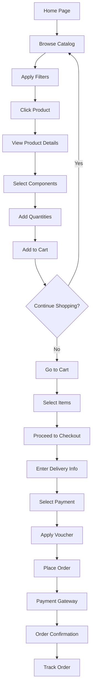
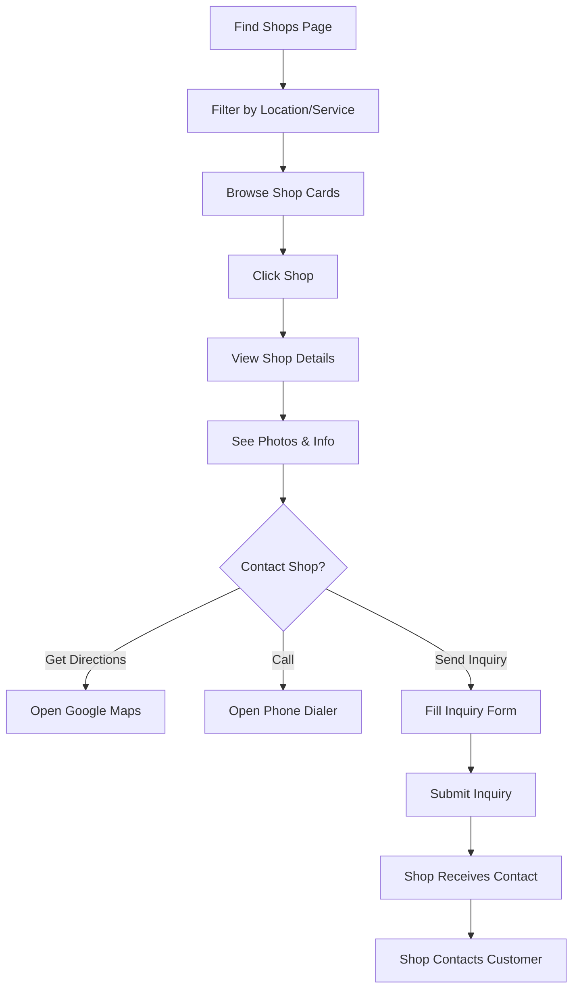
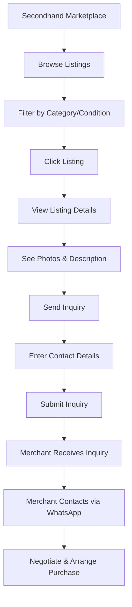
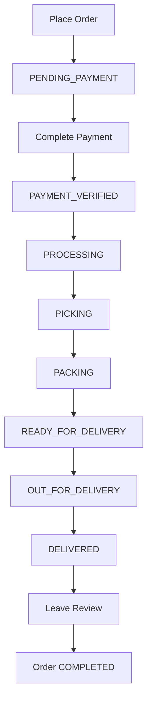
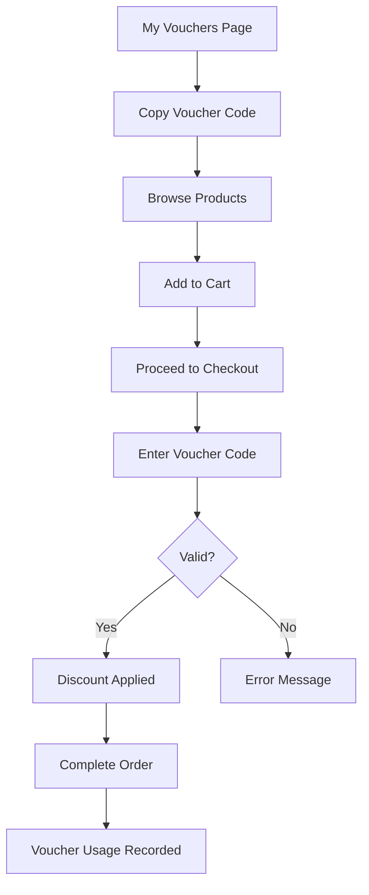

# AutoLab B2C Customer Platform - Complete Documentation

**Platform Type:** B2C E-Commerce (Retail Customers)
**Version:** 2.0
**Last Updated:** December 2025

---

## Table of Contents

1. [System Overview](#system-overview)
2. [User Access & Authentication](#user-access--authentication)
3. [Complete Page Inventory](#complete-page-inventory)
4. [Detailed Page Documentation](#detailed-page-documentation)
5. [Shopping Features](#shopping-features)
6. [Account Management](#account-management)
7. [Customer Workflows](#customer-workflows)
8. [UI/UX Components](#uiux-components)

---

## 1. System Overview

### What is AutoLab B2C?

AutoLab is a B2C automotive parts e-commerce platform serving **retail customers** in Malaysia. Customers can browse products, purchase car accessories and components, track orders, leave reviews, and discover authorized workshops.

### Customer Type: Retail (B2C)

**Account Identifier:** `customer_profiles.customer_type = 'retail'`

**Key Characteristics:**
- Standard retail pricing (higher than merchant pricing)
- Full access to product catalog and shopping
- Cannot create secondhand marketplace listings (view only)
- Cannot access merchant-specific features
- Standard order history access (6 months free)

---

## 2. User Access & Authentication

### Registration

**Route:** `/auth`
**Component:** Authentication page with tabs

**Registration Form Fields:**
| Field | Type | Required | Validation |
|-------|------|----------|------------|
| Full Name | Text | Yes | Min 2 characters |
| Email | Email | Yes | Valid email format |
| Phone | Tel | No | Malaysian format (+60) |
| Password | Password | Yes | Min 6 characters |
| Confirm Password | Password | Yes | Must match password |

**Process:**
1. User clicks "Sign Up" tab
2. Fills registration form
3. Submits form
4. Supabase creates auth.users record
5. Auto-creates customer_profiles record with `customer_type = 'retail'`
6. Email verification sent (if enabled)
7. User logged in automatically
8. Redirected to home page

### Login

**Route:** `/auth`

**Login Form Fields:**
| Field | Type | Required |
|-------|------|----------|
| Email | Email | Yes |
| Password | Password | Yes |

**Process:**
1. User clicks "Sign In" tab
2. Enters credentials
3. Supabase authenticates
4. Session created
5. Redirected to previous page or home

### Password Reset

**Process:**
1. Click "Forgot Password?" link
2. Enter email address
3. Supabase sends reset link
4. User clicks link in email
5. Enters new password
6. Password updated

---

## 3. Complete Page Inventory

### Public Pages (No Login Required)

| Route | Page Name | Purpose |
|-------|-----------|---------|
| `/` | Home | Landing page with hero, features |
| `/catalog` | Product Catalog | Browse all products |
| `/product/:id` | Product Details | View product details, add to cart |
| `/find-shops` | Find Shops | Browse authorized Panel shops |
| `/shop/:id` | Shop Details | View shop information |
| `/secondhand-marketplace` | 2nd Hand Marketplace | Browse used parts listings |
| `/about` | About Us | Company information |
| `/auth` | Login/Register | Authentication |

### Authenticated Customer Pages

| Route | Page Name | Access | Purpose |
|-------|-----------|--------|---------|
| `/profile` | My Profile | Logged in | Manage personal information |
| `/cart` | Shopping Cart | Logged in | View cart, checkout |
| `/my-orders` | My Orders | Logged in | Order history and tracking |
| `/my-vouchers` | My Vouchers | Logged in | Available discount vouchers |
| `/notification-settings` | Notifications | Logged in | Manage notification preferences |

---

## 4. Detailed Page Documentation

### 4.1 HOME PAGE

**Route:** `/`
**File:** `src/pages/Home.tsx`

#### UI Sections

**1. Hero Section**
- Large background image with parallax effect
- Company tagline
- Call-to-action buttons:
  - "Browse Catalog" → `/catalog`
  - "Find Shops" → `/find-shops`
- Animated fade-in entrance

**2. Car Brand Ticker**
- Horizontal scrolling animation
- Shows supported car brands
- Auto-loops infinitely

**3. Features Section**
- Grid layout (1/2/3 columns responsive)
- Feature cards with icons:
  - Wide Selection
  - Quality Products
  - Fast Delivery
  - Expert Support

**4. Company Information**
- About AutoLab
- Why Choose Us
- Contact Information

**5. Footer**
- Quick Links
- Social Media
- Copyright Notice

#### User Actions
- Click "Browse Catalog" → Navigate to `/catalog`
- Click "Find Shops" → Navigate to `/find-shops`
- Click logo → Return to home
- View brand ticker (passive)

---

### 4.2 PRODUCT CATALOG

**Route:** `/catalog`
**File:** `src/pages/Catalog.tsx`

#### Page Layout

**Desktop View:**
- Left sidebar: Filters (sticky, 300px width)
- Main content: Product grid (flex-1)
- Products per row: 3 columns

**Mobile View:**
- Filter cards (collapsible)
- Product grid: 1 column
- Pagination: 12 items per page

#### Search & Filter System

**Search Bar**
- **Location:** Top of page, full width
- **Placeholder:** "Search products..."
- **Searches:** Name, description, brand, model, manufacturer
- **Type:** Real-time filtering (no submit button)
- **Icon:** Search icon (magnifying glass)

**Filter Options:**

| Filter | Type | Options | Effect |
|--------|------|---------|--------|
| Category | Dropdown | Dynamic from database | Filters by product category |
| Car Brand | Dropdown | Dynamic from products | Filters by car brand |
| Manufacturer | Dropdown | Active manufacturers only | Filters by factory brand |
| Search Text | Input | Free text | Full-text search |

**Active Filters Display:**
- Pills showing active filters
- "Clear" button per filter
- "Clear All Filters" button
- Filter count badge on mobile

#### Product Card Design

**Card Components:**
- **Product Image:** Primary image from database
- **Brand Badge:** Car brand in small badge (top-left)
- **Product Name:** Truncated to 2 lines
- **Featured Badge:** Yellow star if `is_featured = true`
- **Category Label:** Small gray text
- **Component Count:** Shows number of components

**Hover Effects:**
- Shadow elevation increases
- Specs overlay appears with:
  - Brand
  - Model
  - Category
  - Year Range
  - Component Count
- Smooth transition animation

**Click Action:**
- Navigate to `/product/{product_id}`

#### Pagination (Mobile Only)

**Display:** Bottom of product grid
**Format:** "Page X of Y"
**Buttons:**
- Previous (disabled on first page)
- Next (disabled on last page)
- Page count display

**Items Per Page:** 12

#### Data Fetching

**Database Tables:**
- `products_new`: Main product data
- `product_images_new`: Product photos
- `categories`: Category names
- `manufacturers`: Factory brands

**Query Filters:**
```sql
WHERE is_active = true
AND (category matches filter OR no category filter)
AND (car_brand matches filter OR no brand filter)
AND (manufacturer_id matches filter OR no manufacturer filter)
AND (name/description matches search OR no search)
ORDER BY is_featured DESC, created_at DESC
```

#### Loading States
- Skeleton cards while loading
- Shimmer animation
- "Loading products..." text

#### Empty States
- No products found message
- "Try adjusting your filters" suggestion
- "Clear Filters" button

---

### 4.3 PRODUCT DETAILS PAGE

**Route:** `/product/:id`
**File:** `src/pages/ProductDetails.tsx`

#### Page Layout (Two Columns)

**Left Column (2/5 width):**
- Main product image
- Thumbnail gallery
- Image zoom functionality

**Right Column (3/5 width):**
- Product information
- Component selection
- Add to cart section

#### Product Information Section

**Display Elements:**

| Element | Description | Source |
|---------|-------------|--------|
| Product Title | Large heading, bold | `products_new.name` |
| Brand Badge | Car brand with icon | `products_new.car_brand` |
| Model Info | Car model name | `products_new.car_model` |
| Year Range | Compatible years | `year_from - year_to` |
| Featured Badge | Yellow star if featured | `is_featured` |
| Category | Product category badge | `category` |
| Description | Full product description | `description` |

#### Image Gallery

**Main Image Display:**
- Large image (aspect ratio maintained)
- Click to open lightbox
- High-quality preview

**Thumbnail Strip:**
- Horizontal scrollable strip
- 4-5 thumbnails visible
- Active thumbnail highlighted
- Click thumbnail → Changes main image

**Lightbox Modal:**
- Full-screen image viewer
- Navigation arrows (prev/next)
- Image counter (e.g., "3 / 8")
- Close button (X icon)
- Keyboard navigation (arrow keys, ESC)
- Dark backdrop

#### Component Selection Interface

**Component List:**
- Maximum height with scroll
- Expandable component rows

**Collapsed Component Row:**
- Small component image (64px)
- Component name
- **Price Display:**
  - **B2C Customers:** `normal_price` shown
  - Format: "RM XXX.XX"
- Stock level indicator
- Expand/collapse arrow

**Expanded Component Row:**
- Large component image (256px, grows on expand)
- Component name (large)
- Component type badge
- Full description
- **Detailed Pricing:**
  - Price per unit
  - Stock status (In Stock / Low Stock / Out of Stock)
- **Quantity Selector:**
  - Minus button (-)
  - Quantity display (center)
  - Plus button (+)
  - Min: 0, Max: stock_quantity
- **Add Button:**
  - "Add" text
  - Only shown if logged in
  - Adds selected quantity to cart
  - Disabled if quantity = 0

**Guest User View:**
- "Login to Add" button instead of "Add"
- Click redirects to `/auth`
- Return URL preserved

**Click Component Image (Expanded):**
- Opens component image in lightbox
- Same lightbox functionality as product images

#### Cart Summary Section

**Located:** Bottom of right column, sticky

**Display Elements:**
- **Selected Items:** Count of components with qty > 0
- **Total Price:** Sum of all component prices × quantities
- **Pricing Logic:** Uses `usePricing` hook
  - B2C customers see `normal_price`
- **Add to Cart Button:**
  - Full width
  - Green background (lime-600)
  - Shows item count badge
  - Disabled if no items selected
  - Guest users see "Login to Add to Cart"

**Add to Cart Action:**
1. Validates user is logged in
2. For each selected component:
   - Creates/updates cart_items record
   - Stores: customer_id, component_id, quantity, unit_price
3. Shows success toast: "Added X items to cart"
4. Option to continue shopping or view cart
5. Cart updates in real-time

#### Reviews Section

**Located:** Below product details

**Display:**
- Average rating (stars)
- Total review count
- Review list (paginated)

**Review Card:**
- Customer name
- Star rating (1-5 stars)
- Review text
- Review images (clickable)
- Helpful count
- Date posted
- Verified Purchase badge

**Write Review (After Purchase):**
- Rating selector (1-5 stars)
- Review text (textarea)
- Upload photos (optional, max 5)
- Submit button
- Redirects to login if not authenticated

#### Product Specifications

**Display in Table Format:**
- Brand, Model, Category
- Year From - Year To
- Dimensions, Weight
- SKU Number
- Availability Status

---

### 4.4 SHOPPING CART PAGE

**Route:** `/cart`
**File:** `src/pages/Cart.tsx`

#### Access Control
- **Requires:** User authentication
- **Redirect if not logged in:** `/auth` with return URL
- **Redirect if empty cart:** `/catalog`

#### Page Layout

**Two-Column Layout:**
- Left column (2/3 width): Cart items
- Right column (1/3 width): Order summary (sticky)

#### Cart Items Section

**Header Row:**
- **Select All Checkbox:** Toggle select all items
- **Clear Cart Button:** Red text, removes all items

**Cart Item Card:**

| Component | Description |
|-----------|-------------|
| **Selection Checkbox** | Individual item selection |
| **Component Image** | 80×80px thumbnail |
| **Component Details** | Name, SKU, product context |
| **Unit Price Badge** | Price per unit (gray badge) |
| **Quantity Controls** | - [qty] + buttons |
| **Item Subtotal** | Quantity × Unit Price |
| **Remove Button** | X icon, red hover |

**Quantity Controls:**
- **Minus Button (-):** Decreases quantity (min 1)
- **Quantity Display:** Current quantity
- **Plus Button (+):** Increases quantity (max: stock available)
- **Real-time Update:** Updates database immediately

**Remove Item:**
- Click X button
- Confirmation toast
- Item removed from cart_items table
- UI updates immediately

#### Order Summary Section

**Display Elements:**

| Line Item | Calculation |
|-----------|-------------|
| **Selected Items** | Count of checked items |
| **Subtotal** | Sum of selected items |
| **Shipping** | "Calculated at checkout" |
| **Tax (SST 6%)** | "Calculated at checkout" |
| **Total** | Subtotal (shipping + tax added at checkout) |

**Checkout Button:**
- Full width, green background
- Text: "Proceed to Checkout"
- Disabled if no items selected
- Click opens Checkout Modal

#### Empty Cart State

**Display:**
- Large shopping bag icon (gray)
- Heading: "Your Cart is Empty"
- Description: "Add items to get started"
- Button: "Browse Catalog" → `/catalog`

#### Cart Data Management

**Database Table:** `cart_items`

**Fields:**
- `id`: UUID primary key
- `customer_id`: FK to customer_profiles
- `component_id`: FK to component_library
- `quantity`: Integer (min 1)
- `unit_price`: Decimal (captured at add time)
- `created_at`, `updated_at`: Timestamps

**Real-time Updates:**
- Uses Supabase real-time subscriptions
- Updates reflect immediately across tabs
- Optimistic UI updates

---

### 4.5 CHECKOUT MODAL

**Triggered From:** Cart page → "Proceed to Checkout" button
**Component:** `CheckoutModal` (embedded in Cart.tsx)

#### Modal Structure

**Full-screen overlay with form sections**

#### Section 1: Delivery Method

**Radio Button Options:**
1. **Self Pickup**
   - No delivery fee
   - Customer collects from store
   - Address not required

2. **Standard Delivery**
   - Delivery fee applies
   - Address required
   - Estimated delivery time shown

#### Section 2: Delivery Address (if delivery selected)

**Form Fields:**

| Field | Type | Required | Validation |
|-------|------|----------|------------|
| Address Line | Text | Yes | Non-empty |
| City | Text | Yes | Non-empty |
| State | Dropdown | Yes | 16 Malaysian states |
| Postcode | Text | Yes | 5 digits |
| Delivery Notes | Textarea | No | Optional instructions |

**State Options:**
Johor, Kedah, Kelantan, Melaka, Negeri Sembilan, Pahang, Penang, Perak, Perlis, Sabah, Sarawak, Selangor, Terengganu, Kuala Lumpur, Labuan, Putrajaya

#### Section 3: Payment Method

**Radio Button Options:**
1. **Online Banking**
   - FPX payment gateway
   - Instant payment

2. **Credit/Debit Card**
   - Stripe payment gateway
   - Card details collected

3. **Cash on Delivery** (only if self-pickup)
   - Pay at collection
   - No online payment

#### Section 4: Apply Voucher

**Voucher Input:**
- Text input for voucher code
- "Apply" button
- Validation:
  - Checks voucher_codes table
  - Validates: is_active, not expired, usage limits
  - Validates min purchase amount
  - Customer type restriction (retail/merchant/all)

**Voucher Applied Display:**
- Green success message
- Voucher code shown
- Discount amount shown
- Remove voucher option

**Voucher Types:**
- **Percentage:** X% off (with optional max discount cap)
- **Fixed Amount:** RM X off
- **Min Purchase:** Requires minimum order amount

#### Section 5: Order Summary

**Line Items:**
| Item | Calculation |
|------|-------------|
| **Items Summary** | List of products with quantities |
| **Subtotal** | Sum of all items |
| **Delivery Fee** | RM X (or "Free" if above threshold) |
| **Voucher Discount** | -RM X (if applied) |
| **SST (6%)** | Subtotal × 0.06 |
| **Grand Total** | Subtotal + Delivery + Tax - Voucher |

**Items Display:**
- Component name
- Quantity × Unit Price
- Line total

#### Submit Order Button

**Location:** Bottom of modal
**Text:** "Place Order - RM XXX.XX"
**State:** Disabled during processing

**Click Action:**
1. Validates all required fields
2. Calculates final totals
3. Creates order in database:
   - `orders` table: Main order record
   - `order_items` table: Line items
   - `voucher_usage` table: If voucher used
4. Generates unique order number: `ORD-YYYYMMDD-XXX`
5. Updates cart (removes checked items)
6. Redirects to payment gateway (if online payment)
7. Shows success message
8. Navigates to `/my-orders` with order ID

#### Order Creation Details

**Database Tables:**

**orders**
```sql
{
  id: UUID,
  customer_id: FK to customer_profiles,
  order_number: "ORD-20251230-001",
  status: "PENDING_PAYMENT", -- Initial status
  subtotal: Decimal,
  delivery_fee: Decimal,
  tax_amount: Decimal,
  discount_amount: Decimal,
  total_amount: Decimal,
  payment_method: String,
  payment_status: "UNPAID",
  delivery_method: "pickup" | "delivery",
  delivery_address: JSONB,
  voucher_id: UUID (nullable),
  customer_notes: Text (nullable),
  created_at: Timestamp
}
```

**order_items**
```sql
{
  id: UUID,
  order_id: FK to orders,
  component_id: FK to component_library,
  product_id: FK to products_new,
  quantity: Integer,
  unit_price: Decimal (captured at order time),
  subtotal: quantity × unit_price
}
```

---

### 4.6 MY ORDERS PAGE

**Route:** `/my-orders`
**File:** `src/pages/MyOrders.tsx`

#### Access Control
- **Requires:** User authentication
- **Redirect if not logged in:** Shows sign-in prompt with redirect

#### Page Sections

**1. Recent Orders (Last 6 Months)**
- Free access for all customers
- Full order details
- Expandable order cards

**2. Archived Orders (Older than 6 Months)**
- **Free Access:** Limited view with lock overlay
- **Extended Access:** Full access with subscription
- Upgrade prompt for non-subscribers

#### Order Card Display

**Card Layout:**

| Element | Description |
|---------|-------------|
| **Order Number** | Large heading with order ID |
| **Status Badge** | Color-coded status (see table below) |
| **Order Date** | Created timestamp |
| **Item Count** | "X items (Y pieces total)" |
| **Payment Status** | Badge with payment state |
| **Total Amount** | Large bold text "RM XXX.XX" |
| **View Details Button** | Expands order details modal |

**Order Status Display:**

| Status | Icon | Color | Description |
|--------|------|-------|-------------|
| PENDING_PAYMENT | Clock | Gray | Awaiting payment |
| PAYMENT_VERIFIED | CheckCircle | Blue | Payment confirmed |
| PROCESSING | Package | Yellow | Being prepared |
| PACKING | Package | Orange | Items being packed |
| DISPATCHED | Truck | Blue | Shipped out |
| OUT_FOR_DELIVERY | Truck | Blue | In transit |
| DELIVERED | CheckCircle | Green | Delivered to customer |
| COMPLETED | CheckCircle | Green | Order complete |
| CANCELLED | XCircle | Red | Order cancelled |
| REJECTED | XCircle | Red | Order rejected |

**Payment Status Display:**

| Status | Color | Description |
|--------|-------|-------------|
| APPROVED | Green | Payment successful |
| SUBMITTED | Yellow | Payment pending verification |
| REJECTED | Red | Payment failed/declined |
| UNPAID | Gray | No payment received |

#### Order Details Modal

**Trigger:** Click "View Details" on any order card

**Modal Sections:**

**1. Order Header**
- Order number
- Order date
- Status badges (order + payment)

**2. Order Information Card**
| Field | Description |
|-------|-------------|
| Order ID | Full UUID |
| Payment Method | Bank Transfer / Card / COD |
| Payment Status | Badge with current state |

**3. Delivery Information Card**
| Field | Description |
|-------|-------------|
| Delivery Method | Self Pickup / Standard Delivery |
| Delivery Fee | RM amount or "Free" |
| Delivery Address | Full address (if applicable) |

**4. Order Items Table**

| Column | Description |
|--------|-------------|
| SKU | Component SKU code |
| Component | Component name |
| Product | Product context |
| Quantity | Order quantity |
| Unit Price | Price per unit |
| Total | Quantity × Unit Price |

**5. Order Summary**
- **Subtotal:** Sum of all items
- **Voucher Discount:** -RM X (if used)
- **Other Discounts:** -RM X (if applicable)
- **Delivery Fee:** +RM X
- **SST Tax (6%):** +RM X
- **Grand Total:** Final amount

**6. Order Notes**
- Customer notes (if provided)
- Display in info box

**7. Action Buttons**
- **Close:** Closes modal
- **Print:** Opens print dialog
- **Leave Review:** (if delivered) → Navigate to review page
- **Track Order:** (if shipped) → Shows tracking info

#### Extended Access Feature

**Purpose:** Access order history older than 6 months

**Locked State Display:**
- Semi-transparent lock overlay
- Lock icon
- "Unlock Full History" button
- Teaser text: "View all your orders from the beginning"

**Upgrade Dialog:**

**Triggered By:** Click "Unlock Full History" button

**Dialog Content:**
- Pricing plans display
- Feature comparison
- Purchase buttons

**Pricing Plans:**
| Plan | Price | Duration | Features |
|------|-------|----------|----------|
| Monthly | RM 9.90/month | 30 days | Full history access |
| Lifetime | RM 99 (one-time) | Forever | Unlimited access |

**Purchase Process:**
1. Click plan purchase button
2. Redirect to payment gateway
3. Payment confirmed
4. Record created in `order_history_access` table
5. Immediate access granted
6. Return to orders page

**Extended Access Status:**
- Checked via `order_history_access` table
- Filters: is_active = true, expires_at > now (if not lifetime)

---

### 4.7 MY PROFILE PAGE

**Route:** `/profile`
**File:** `src/pages/Profile.tsx`

#### Access Control
- **Requires:** User authentication
- **Supports:** Both customer and admin profiles

#### Profile Display

**Profile Header Card:**

| Element | Description |
|---------|-------------|
| Avatar Circle | Large circle with initial (first letter of name) |
| Full Name | Large heading |
| Email Address | Subtitle text |
| Account Type Badge | B2C Customer (gray) / Admin (red) |
| Edit Button | Top-right corner |

**B2C Customer Badge:**
- Gray background
- Shopping cart icon
- Text: "B2C Customer"

#### Profile Details Card

**View Mode (Two-Column Grid):**

| Field | Display | Editable |
|-------|---------|----------|
| Full Name | Text | Yes |
| Email | Text | Yes |
| Phone | Text | Yes |
| Member Since | Date (read-only) | No |
| Account Type | Badge | No |
| Address | Full address | Yes |

**Edit Mode:**
- Click "Edit" button
- Fields become input elements
- Save and Cancel buttons appear

**Edit Mode Form:**

| Field | Input Type | Validation |
|-------|------------|------------|
| Full Name | Text input | Required, min 2 chars |
| Email | Email input | Required, valid email |
| Phone | Tel input | Optional, Malaysian format |
| Address | Textarea | Optional |

**Save Button:**
- Green background (lime-600)
- Text: "Save Changes"
- Click action:
  1. Validates all fields
  2. Updates `customer_profiles` table
  3. Shows success toast
  4. Exits edit mode

**Cancel Button:**
- Gray outline
- Text: "Cancel"
- Reverts to original data
- Exits edit mode

#### Data Management

**Database Table:** `customer_profiles`

**RPC Function:** `get_my_profile(user_id)`

**Update Query:**
```sql
UPDATE customer_profiles
SET
  full_name = ?,
  phone = ?,
  address = ?
WHERE user_id = current_user_id
```

---

### 4.8 FIND SHOPS PAGE

**Route:** `/find-shops`
**File:** `src/pages/FindShops.tsx`

#### Purpose
Browse authorized Panel tier merchant shops (top 100 in Malaysia)

#### Access Control
- **Public:** No login required
- **Filter:** Only shows Panel tier shops

#### Search & Filter Section

**Search Bar:**
- Placeholder: "Search shops, cities..."
- Searches: business_name, city, description
- Real-time filtering

**Filter Dropdowns:**

| Filter | Options | Effect |
|--------|---------|--------|
| State | All States + 16 Malaysian states | Filters by shop location |
| Services | All Services + 7 service types | Filters by services_offered |

**Service Types:**
1. Installation Service
2. Repair & Maintenance
3. Consultation
4. Product Sourcing
5. Warranty Service
6. Custom Orders
7. Delivery Available

**Active Filters Display:**
- Shows: "Showing X of Y shops"
- "Clear Filters" button (lime-600 text)

#### Shop Card Display

**Grid Layout:**
- Mobile: 1 column
- Tablet: 2 columns
- Desktop: 3 columns
- Large Desktop: 4 columns

**Shop Card Structure:**

**1. Shop Photo Section (192px height)**
- Auto-rotating carousel (changes every 3 seconds)
- Multiple shop photos
- Gradient overlay on hover
- Photo indicators (dots)
- Fallback: Store icon if no photos

**2. Featured Badge** (if is_featured = true)
- Position: Top-right absolute
- Color: Lime-500 background
- Icon: Award icon
- Text: "FEATURED"

**3. Card Content:**
- **Business Name:** Truncated, hover → lime-600
- **Business Type:** Small gray text
- **Location:** City, State with MapPin icon
- **Services:** First service + count of others
  - Example: "Installation Service +3 more"
- **View Details Button:** Full width

**Card Styling:**
- White background with 80% opacity
- Backdrop blur effect
- Gray-100 border
- Featured shops: Lime-400 ring
- Shadow: MD, hover → LG
- Border radius: XL

**Auto-Photo Rotation:**
- Timer: 3000ms (3 seconds)
- Visual indicators: Dots below image
- Current photo highlighted
- Smooth fade transition

**Click Action:**
- Navigate to `/shop/{shop.id}`

#### Loading State
- Store icon (pulsing animation)
- Lime-600 color
- Text: "Finding shops..."

#### Empty State
- MapPin icon in gray circle
- Heading: "No Shops Found"
- Description: "Try adjusting your filters to see more results"
- "Clear Filters" button (if filters active)

#### Data Source

**Database Query:**
```sql
SELECT * FROM premium_partnerships
WHERE subscription_plan = 'panel'
  AND subscription_status = 'ACTIVE'
  AND admin_approved = true
ORDER BY is_featured DESC, total_views DESC
```

**Joined Data:**
- Shop photos from shop_photos array
- Business information
- Services offered
- Location details

---

### 4.9 SHOP DETAILS PAGE

**Route:** `/shop/:shopId`
**File:** `src/pages/ShopDetails.tsx`

#### View Counter
- **Auto-increments on page load**
- Uses RPC: `increment_partnership_views(shop_id)`
- Updates `premium_partnerships.total_views`

#### Hero Section

**Cover Photo Display:**
- Large banner image (full width)
- Height: 300px (mobile), 400px (desktop)
- Auto-rotating gallery (4-second intervals)
- Gradient overlay

**Shop Logo:**
- Circular overlay (128×128px)
- Positioned: Bottom-left of cover
- White border, shadow

**Featured Badge:**
- Top-right corner (if applicable)
- Lime background
- Text: "FEATURED PANEL SHOP"

**Back Button:**
- Top-left corner
- Text: "← Back to Shops"
- Navigate to `/find-shops`

#### Shop Information Section

**Business Name:**
- Large heading (2XL, bold)
- Business type badge below

**Description:**
- Full business description
- Multi-line text
- Readable font size

**Services Offered:**
- Badge grid layout
- Color-coded service badges
- All services displayed

**Operating Hours Table:**
| Day | Hours |
|-----|-------|
| Monday | 9:00 AM - 6:00 PM |
| Tuesday | 9:00 AM - 6:00 PM |
| ... | ... |
| Sunday | Closed |

*Note: Currently uses sample data, to be integrated with database*

#### Contact Information Section

**Phone Number:**
- Large, clickable
- Icon: Phone
- Click action: `tel:+60XXXXXXXXX`
- Opens phone dialer

**Email Address:**
- Clickable
- Icon: Mail
- Click action: `mailto:email@example.com`
- Opens email client

**Website Link:**
- Clickable
- Icon: Globe
- Opens in new tab
- External link indicator

**Social Media Links:**
- Facebook icon + link
- Instagram icon + link
- Opens in new tab

#### Location Section

**Full Address Display:**
- Address line
- City, State Postcode
- Icon: MapPin

**Google Maps Integration:**
- Embedded map (if coordinates available)
- Map height: 300px
- Marker: Shop location
- Interactive map (zoom, pan)

**Get Directions Button:**
- Full width, lime background
- Icon: Navigation
- Click action: Opens Google Maps
- URL format: `https://maps.google.com/?q=lat,lng`

#### Photo Gallery Section

**Grid Layout:**
- 2 columns (mobile)
- 3 columns (tablet)
- 4 columns (desktop)

**Photo Cards:**
- Aspect ratio: Square
- Clickable
- Hover: Brightness increase
- Border radius: LG

**Click Photo:**
- Opens lightbox modal
- Full-screen view
- Navigation arrows
- Photo counter (e.g., "3 / 12")
- Close button

#### Inquiry Form Section

**Purpose:** Contact shop owner

**Form Fields:**

| Field | Type | Required | Validation |
|-------|------|----------|------------|
| Your Name | Text | Yes | Non-empty |
| WhatsApp Number | Tel | Yes | Malaysian format |
| Email | Email | No | Valid email if provided |
| Message | Textarea | No | Optional inquiry details |

**Phone Number Validation:**
- Malaysian format: +60XXXXXXXXX or 0XXXXXXXXX
- Must be 9-10 digits after prefix

**Submit Button:**
- Text: "Send Inquiry"
- Green background
- Icon: Send

**Submit Process:**
1. Validates required fields
2. Creates entry in `shop_inquiries` table
3. Increments `premium_partnerships.total_inquiries`
4. Shows success toast: "Inquiry sent! The shop will contact you soon."
5. Form resets
6. Shop owner receives notification

#### Inquiry Data Storage

**Database Table:** `shop_inquiries`

```sql
{
  id: UUID,
  shop_id: FK to premium_partnerships,
  customer_name: Text,
  whatsapp_number: Text,
  email: Text (nullable),
  message: Text (nullable),
  created_at: Timestamp
}
```

---

### 4.10 SECONDHAND MARKETPLACE PAGE

**Route:** `/secondhand-marketplace`
**File:** `src/pages/SecondhandMarketplace.tsx`

#### Purpose
Browse used/refurbished automotive parts listed by merchants

#### Access Control
- **Public:** No login required
- **Filter:** Only shows approved listings (`status = 'approved'`)
- **B2C Customers:** View only (cannot create listings)

#### Search & Filter Section

**Search Bar:**
- Placeholder: "Search listings..."
- Icon: Search
- Searches: title, description, seller name

**Filter Button:**
- Shows filter panel
- Badge: Active filter count

**Filters Panel** (expandable):

| Filter | Type | Options |
|--------|------|---------|
| Category | Dropdown | All + 8 categories |
| Condition | Dropdown | All + 4 conditions |
| Min Price | Number | RM amount |
| Max Price | Number | RM amount |

**Product Categories:**
1. Head Units & Displays
2. Dashcams & Cameras
3. Audio Systems
4. GPS & Navigation
5. Sensors & Electronics
6. Accessories
7. Other

**Condition Types:**
- **Brand New:** Green badge
- **Like New:** Blue badge
- **Good:** Yellow badge
- **Fair:** Orange badge
- **Used:** Gray badge

**Clear Filters Button:**
- Resets all filters
- Collapses filter panel

#### Listing Card Display

**Grid Layout:**
- Mobile: 1 column
- Tablet: 2 columns
- Desktop: 3 columns

**Listing Card Structure:**

**1. Product Image:**
- First image from images array
- Aspect ratio: 4:3
- Fallback: Package icon placeholder

**2. Condition Badge** (top-right):
- Color-coded by condition
- Text: Condition name

**3. Discount Badge** (if applicable):
- Shows if original_price > selling_price
- Format: "XX% OFF"
- Red background

**4. Card Content:**
- **Title:** Bold, line-clamp-2
- **Description:** Gray, line-clamp-2
- **Selling Price:** Large, blue, bold
- **Original Price:** Strikethrough (if discounted)
- **Seller Shop Name:** With store icon
- **Location:** City with MapPin icon
- **Stats Row:**
  - View count (Eye icon)
  - Inquiry count (Message icon)
- **Time Posted:** "2 days ago" format
- **Category Badge:** Small colored badge

**Hover Effect:**
- Shadow elevation increases
- Slight scale transform

**Click Card:**
- Opens listing detail modal

#### Listing Detail Modal

**Full-Screen Modal Layout:**

**1. Image Gallery:**
- Large main image display
- Thumbnail strip below
- Previous/Next navigation arrows
- Image counter (e.g., "3 / 5")
- Click thumbnail: Changes main image

**2. Price & Condition Section:**
- Large selling price (blue, bold)
- Original price (strikethrough, if different)
- Savings calculation
- Condition badge (colored)

**3. Description Section:**
- Heading: "Description"
- Full description text
- Preserves line breaks
- Scrollable if long

**4. Details Grid:**
| Detail | Display |
|--------|---------|
| Category | Badge with icon |
| Location | City, state with MapPin |
| Usage History | "Used for X months" |
| Year Purchased | YYYY format |
| Reason for Selling | Full text |
| Compatible Cars | Car brand + model badges |

**5. Stats Display:**
- View count with Eye icon
- Inquiry count with Message icon

**6. Send Inquiry Button:**
- Full width at bottom
- Green background
- Icon: Send
- Text: "Send Inquiry to Seller"
- Click: Opens inquiry form dialog

#### Send Inquiry Dialog

**Form Fields:**

| Field | Type | Required | Validation |
|-------|------|----------|------------|
| Your Name | Text | Yes | Non-empty |
| WhatsApp Number | Tel | Yes | Malaysian format |
| Email | Email | No | Valid email format |
| Message | Textarea | No | Optional inquiry text |

**Submit Process:**
1. Validates required fields
2. Creates `secondhand_inquiries` record
3. Increments listing inquiry_count
4. Increments listing views_count
5. Shows success toast
6. Seller receives contact details
7. Dialog closes

**Inquiry Storage:**

```sql
{
  id: UUID,
  listing_id: FK to secondhand_listings,
  customer_name: Text,
  whatsapp_number: Text,
  email: Text (nullable),
  message: Text (nullable),
  created_at: Timestamp
}
```

#### Empty State
- Package icon (gray, large)
- Heading: "No Listings Found"
- Description: "Check back later for new listings"
- Optional: "Browse Products" button → `/catalog`

#### Loading State
- Skeleton cards with shimmer animation
- Text: "Loading listings..."

---

### 4.11 MY VOUCHERS PAGE

**Route:** `/my-vouchers`
**File:** `src/pages/MyVouchers.tsx`

#### Access Control
- **Requires:** User authentication
- **Filter:** Shows vouchers available to current customer

#### Voucher Card Design (Ticket Style)

**Card Structure:**

**1. Header Section** (Dark Background):
- Decorative circles for ticket perforation effect
- Voucher code (large monospace font)
- Copy button (clipboard icon)
- Discount icon (Percent or Dollar sign)
- Discount amount (XL bold text)

**2. Details Section:**
- Voucher name (heading)
- Voucher description
- Usage progress bar
- Minimum purchase requirement
- Expiry date
- "Copy & Use" button or "Limit Reached" badge

#### Voucher Information Display

| Field | Format | Example |
|-------|--------|---------|
| Code | Uppercase, monospace | `WELCOME50` |
| Discount Type | PERCENTAGE or FIXED | 15% or RM 50 |
| Discount Value | Formatted | "15% OFF" or "RM 50" |
| Max Discount | (For percentage) | "Max RM 30" |
| Min Purchase | Required amount | "Min RM 100" |
| Expiry Date | Formatted date | "Valid until Dec 31, 2025" |
| Usage | X / Y format | "2 / 5 uses" |

#### Usage Progress Bar

**Visual Indicator:**
- Progress bar width = (used / max) × 100%
- Color coding:
  - Green: < 50% used
  - Yellow: 50-99% used
  - Red: 100% used (limit reached)

**Text Display:** "Used 2 out of 5 times"

#### Copy to Clipboard Feature

**Trigger Actions:**
1. Click voucher code
2. Click "Copy & Use" button

**Copy Process:**
1. Copies code to clipboard
2. Shows checkmark icon (2 seconds)
3. Toast notification: "Code copied!"
4. Icon reverts to clipboard

**Browser Compatibility:**
- Uses `navigator.clipboard.writeText()`
- Fallback for older browsers

#### How to Use Section

**Step-by-Step Guide:**
1. Copy your voucher code
2. Add items to cart
3. Proceed to checkout
4. Enter voucher code
5. Enjoy your discount!

**Display:**
- Numbered list
- Icons for each step
- Info box styling

#### Empty State
- Ticket icon (gray, large)
- Heading: "No Vouchers Available"
- Description: "Check back later for special offers"
- Button: "Start Shopping" → `/catalog`

#### Voucher Eligibility

**Data Source:** RPC function `get_available_vouchers_for_customer(customer_id)`

**Filter Criteria:**
```sql
WHERE is_active = true
  AND (valid_until IS NULL OR valid_until > NOW())
  AND (customer_type_restriction = 'ALL' OR customer_type_restriction = 'normal')
  AND (usage_count < max_total_usage OR max_total_usage IS NULL)
  AND (user_usage_count < max_usage_per_user)
  AND (assigned_to_customer_id IS NULL OR assigned_to_customer_id = current_customer_id)
```

---

### 4.12 NOTIFICATION SETTINGS PAGE

**Route:** `/notification-settings`
**File:** `src/pages/NotificationSettings.tsx`

#### Purpose
Manage email and WhatsApp notification preferences

#### WhatsApp Settings Card

**Phone Number Input:**
- Label: "WhatsApp Number"
- Format: Malaysian (+60 or 0 prefix)
- Pre-filled from customer profile
- Editable text input

**WhatsApp Toggle:**
- Switch component
- Label: "Enable WhatsApp Notifications"
- On state: Green checkmark + phone number display
- Off state: Gray, disabled message

**Save Button:**
- Only appears when changes made
- Text: "Save WhatsApp Settings"
- Green background
- Icon: Save

**Validation:**
- Phone required if WhatsApp enabled
- Malaysian format: +60XXXXXXXXX or 0XXXXXXXXX

#### Quick Actions Card

**Bulk Toggle Buttons:**
- "Enable All Notifications" button
- "Disable All Notifications" button
- Affects all categories simultaneously

#### Notification Categories

**1. Order Updates**
- Order Confirmed
- Order Packing
- Order Shipped
- Order Delivered
- Order Cancelled

**2. Product Updates**
- New Products
- Price Drops
- Back in Stock

**3. Shop Communications**
- Shop Announcements

**4. Promotions & Marketing**
- Promotions & Offers

#### Category Display

**Each Category Shows:**
- Category icon (emoji)
- Category title (heading)
- Category description
- "Enable All" / "Disable All" for category
- Individual notification toggles

#### Individual Notification Toggle

**For Each Notification Type:**
- Notification label (e.g., "Order Confirmed")
- Description (e.g., "Get notified when your order is confirmed")
- Toggle switch
- Current state (on/off)

**Toggle Behavior:**
- Click: Immediately updates database
- Optimistic UI update
- Toast notification confirms change
- No save button needed (auto-save)

#### Data Management

**Database Table:** `notification_preferences`

**Fields:**
```sql
{
  id: UUID,
  user_id: FK to auth.users,
  notification_type: Text (e.g., "order_confirmed"),
  is_enabled: Boolean,
  whatsapp_phone: Text (nullable),
  whatsapp_opt_in: Boolean,
  created_at: Timestamp,
  updated_at: Timestamp
}
```

**Insert/Update Logic:**
```sql
-- If preference doesn't exist: INSERT
-- If exists: UPDATE is_enabled field
ON CONFLICT (user_id, notification_type)
DO UPDATE SET is_enabled = ?, updated_at = NOW()
```

#### Info Footer

**Blue Alert Box:**
- Icon: Info circle
- Message: "You will receive notifications via email and WhatsApp (if enabled above)"
- Additional note: "Make sure to enable WhatsApp notifications above to receive messages"

---

## 5. Shopping Features

### 5.1 Pricing System

#### B2C Pricing Display

**Hook Used:** `usePricing()` from `src/hooks/usePricing.tsx`

**Context Values:**
```typescript
{
  customerType: 'normal',
  pricingMode: 'B2C',
  showsMerchantPrice: false,
  getDisplayPrice: (normalPrice, merchantPrice) => normalPrice
}
```

**Price Label:** "Price" (not "Merchant Price")

**Display Format:**
- Currency: MYR (RM)
- Format: "RM XXX.XX"
- Decimal places: 2

**Example:**
```typescript
const { getDisplayPrice } = usePricing();
const price = getDisplayPrice(product.normal_price, product.merchant_price);
// B2C Customer sees: product.normal_price
// Returns: 150.00 (instead of merchant_price: 120.00)
```

### 5.2 Cart System

#### Database-Persisted Cart

**Storage:** Supabase `cart_items` table (not localStorage)

**Benefits:**
- Syncs across devices
- Persists between sessions
- Real-time updates
- Server-side validation

**Cart Operations:**

| Operation | Function | Database Action |
|-----------|----------|-----------------|
| Add Item | `addToCart(component, qty)` | INSERT INTO cart_items |
| Update Quantity | `updateQuantity(item_id, qty)` | UPDATE cart_items SET quantity |
| Remove Item | `removeItem(item_id)` | DELETE FROM cart_items WHERE id |
| Clear Cart | `clearCart()` | DELETE FROM cart_items WHERE customer_id |
| Get Cart | `getCart()` | SELECT FROM cart_items WHERE customer_id |

**Hook:** `useCart()` (custom hook)

```typescript
const {
  cart,           // Array of cart items
  loading,        // Loading state
  addToCart,      // Add item function
  updateQuantity, // Update function
  removeItem,     // Remove function
  clearCart,      // Clear all function
  total          // Cart total
} = useCart();
```

### 5.3 Checkout Process

#### Step-by-Step Flow

**1. Cart Review**
- Customer selects items to purchase
- Reviews quantities and prices
- Clicks "Proceed to Checkout"

**2. Checkout Modal Opens**
- Delivery method selection
- Address input (if delivery)
- Payment method selection
- Voucher application
- Order summary review

**3. Order Validation**
- Required field checks
- Address validation
- Payment method validation
- Stock availability check
- Voucher validation

**4. Order Creation**
- Generate unique order number
- Create order record
- Create order items
- Record voucher usage (if applicable)
- Update cart status

**5. Payment Processing**
- Redirect to payment gateway (if online)
- Process payment
- Update payment status
- Return to platform

**6. Order Confirmation**
- Success message displayed
- Email confirmation sent
- WhatsApp notification (if enabled)
- Redirect to `/my-orders`

### 5.4 Voucher System

#### Voucher Types

**1. Percentage Discount**
- Format: "15% OFF"
- Max discount cap (optional): "Max RM 50"
- Calculation: (subtotal × percentage) capped at max_discount

**2. Fixed Amount**
- Format: "RM 50 OFF"
- Simple subtraction from total

#### Voucher Validation Rules

| Rule | Check | Error Message |
|------|-------|---------------|
| Active | `is_active = true` | "Voucher is no longer active" |
| Not Expired | `valid_until > NOW()` | "Voucher has expired" |
| Usage Limit | `usage_count < max_total_usage` | "Voucher usage limit reached" |
| Per-User Limit | `user_usage_count < max_usage_per_user` | "You've reached the usage limit for this voucher" |
| Min Purchase | `order_subtotal >= min_purchase_amount` | "Minimum purchase of RM XXX required" |
| Customer Type | `customer_type_restriction IN ('ALL', 'normal')` | "This voucher is not available for your account type" |

#### Voucher Application Process

**1. User enters code in checkout**
**2. Validate voucher:**
```sql
SELECT * FROM voucher_codes
WHERE code = UPPER(user_input)
  AND is_active = true
  AND (valid_until IS NULL OR valid_until > NOW())
  AND (customer_type_restriction = 'ALL' OR customer_type_restriction = 'normal')
```

**3. Check usage limits:**
```sql
-- Total usage
SELECT COUNT(*) FROM voucher_usage
WHERE voucher_id = ?

-- User usage
SELECT COUNT(*) FROM voucher_usage
WHERE voucher_id = ? AND customer_id = ?
```

**4. Calculate discount:**
```typescript
let discount = 0;
if (voucher.discount_type === 'PERCENTAGE') {
  discount = subtotal * (voucher.discount_value / 100);
  if (voucher.max_discount_amount) {
    discount = Math.min(discount, voucher.max_discount_amount);
  }
} else {
  discount = voucher.discount_value;
}
```

**5. Apply to order:**
- Subtract discount from total
- Store voucher_id in order record
- Create voucher_usage record on order completion

---

## 6. Account Management

### 6.1 Customer Profile

**Editable Fields:**
- Full Name
- Email Address
- Phone Number
- Delivery Address

**Read-Only Fields:**
- Account Type (always "B2C Customer")
- Member Since (registration date)
- User ID

**Update Process:**
1. Click "Edit" button
2. Modify fields
3. Click "Save Changes"
4. Validation runs
5. Database updated
6. Success toast shown
7. Exit edit mode

### 6.2 Order History

**Recent Orders (Free):**
- Last 6 months of orders
- Full details available
- No restrictions

**Archived Orders (Subscription):**
- Orders older than 6 months
- Requires Extended Access purchase
- Monthly or lifetime options

**Order Tracking:**
- Real-time status updates
- Email notifications
- WhatsApp notifications (if enabled)
- Tracking number (when shipped)

### 6.3 Notification Preferences

**Channels:**
1. Email (always available)
2. WhatsApp (opt-in required)

**Categories:**
- Order updates (5 types)
- Product updates (3 types)
- Shop communications (1 type)
- Promotions (1 type)

**Management:**
- Toggle per notification type
- Bulk enable/disable per category
- Enable/disable all

**Immediate Effect:**
- Changes save automatically
- No delay in notification settings

---

## 7. Customer Workflows

### 7.1 Product Discovery & Purchase



### 7.2 Shop Discovery & Inquiry



### 7.3 Secondhand Purchase



### 7.4 Order Tracking



### 7.5 Voucher Usage



---

## 8. UI/UX Components

### 8.1 Design System

**Color Palette:**
- **Primary:** Lime-600 (#65a30d) - CTA buttons, links
- **Secondary:** Gray-900 (#111827) - Text, headings
- **Success:** Green-500 (#22c55e) - Success states
- **Warning:** Orange-500 (#f97316) - Warnings
- **Error:** Red-500 (#ef4444) - Errors
- **Info:** Blue-500 (#3b82f6) - Information

**Typography:**
- **Headings:** Font-heading, Bold, Uppercase, Italic
- **Body:** Default sans-serif, Medium weight
- **Labels:** Tiny (text-xs), Bold, Uppercase, Wide tracking

**Spacing:**
- Base unit: 4px (Tailwind default)
- Common spacing: 2, 3, 4, 6, 8, 12, 16

### 8.2 Common Components

**Buttons:**
- **Primary:** Lime-600 bg, white text, rounded-full
- **Secondary:** White bg, gray border, rounded-lg
- **Danger:** Red-600 bg, white text
- **Icon Buttons:** Square, gray background

**Input Fields:**
- **Standard:** White bg, gray-200 border, focus → lime-600
- **Textarea:** Multi-line with resize
- **Dropdown:** Custom select with arrow icon

**Badges:**
- **Status:** Color-coded backgrounds
- **Category:** Rounded-full, small text
- **Count:** Circular, absolute positioned

**Cards:**
- **Standard:** White bg, gray border, rounded-xl, shadow-md
- **Hover:** Shadow increase, border color change
- **Clickable:** Cursor pointer, transition effects

**Modals:**
- **Backdrop:** Black with 50% opacity
- **Container:** White, rounded-2xl, max-width constraints
- **Close:** X button top-right
- **Responsive:** Full-screen on mobile

**Toast Notifications:**
- **Success:** Green background, checkmark icon
- **Error:** Red background, X icon
- **Info:** Blue background, info icon
- **Position:** Bottom-right (desktop), bottom-center (mobile)
- **Duration:** 3-5 seconds auto-dismiss

### 8.3 Loading States

**Skeleton Loaders:**
- Gray animated shimmer
- Matches content structure
- Smooth transition to actual content

**Spinners:**
- Circular spinner with lime-600 color
- Centered in container
- With loading text below

**Progress Bars:**
- Linear progress indicator
- Color-coded by context
- Percentage display

### 8.4 Empty States

**Standard Pattern:**
- Large gray icon (related to content)
- Heading explaining empty state
- Descriptive text
- Call-to-action button

**Examples:**
- Empty cart → Shopping bag icon, "Browse Catalog" button
- No vouchers → Ticket icon, "Start Shopping" button
- No orders → Package icon, "Browse Products" button

### 8.5 Responsive Breakpoints

**Mobile First Approach:**

| Breakpoint | Width | Usage |
|------------|-------|-------|
| Default | < 640px | Mobile phones |
| sm | ≥ 640px | Large phones |
| md | ≥ 768px | Tablets |
| lg | ≥ 1024px | Laptops |
| xl | ≥ 1280px | Desktops |
| 2xl | ≥ 1536px | Large screens |

**Responsive Patterns:**
- **Grids:** `grid-cols-1 md:grid-cols-2 lg:grid-cols-3`
- **Flex:** `flex-col md:flex-row`
- **Spacing:** `p-4 md:p-6 lg:p-8`
- **Text:** `text-base md:text-lg lg:text-xl`

---

## 9. Technical Details

### 9.1 Frontend Stack

- **Framework:** React 18 with TypeScript
- **Build Tool:** Vite
- **Routing:** React Router v6
- **UI Library:** Tailwind CSS + shadcn/ui
- **Icons:** Lucide React
- **State:** React Hooks (useState, useEffect, useContext)

### 9.2 Backend Integration

- **Database:** Supabase (PostgreSQL)
- **Authentication:** Supabase Auth (JWT)
- **Storage:** Supabase Storage (images)
- **Real-time:** Supabase Subscriptions

### 9.3 Key Database Tables

**customer_profiles:**
- Customer account information
- Links to auth.users
- Stores customer_type ('retail' for B2C)

**orders:**
- Order records
- Status tracking
- Payment information

**order_items:**
- Line items for each order
- Product components ordered
- Quantities and prices

**cart_items:**
- Persistent shopping cart
- Per-customer storage
- Real-time sync

**voucher_codes:**
- Discount vouchers
- Usage tracking
- Expiry management

**secondhand_listings:**
- Used parts marketplace
- Merchant listings only
- Admin moderation

**premium_partnerships:**
- Panel shop information
- For Find Shops directory
- Merchant business details

---

## 10. Customer Support

### Self-Service Features

**1. Order Tracking**
- Real-time status updates
- Tracking numbers
- Delivery estimates

**2. Notification Preferences**
- Customize alert channels
- Control frequency
- Opt-in/opt-out

**3. Profile Management**
- Update contact information
- Manage addresses
- View order history

### Contact Channels

**For Inquiries:**
- Shop inquiry forms
- Merchant inquiry forms
- Email support (to be implemented)
- WhatsApp support (to be implemented)

---

## 11. Security & Privacy

### Authentication

- Secure JWT tokens
- Session management
- Email verification (optional)
- Password requirements

### Data Protection

- Personal data encrypted
- Secure payment gateway
- HTTPS connections
- No credit card storage

### Privacy Controls

- Notification opt-in
- Data access management
- Profile visibility controls

---

## 12. Key Differences: B2C vs B2B

| Feature | B2C (Retail) | B2B (Merchant) |
|---------|--------------|----------------|
| **Pricing** | `normal_price` (higher) | `merchant_price` (lower) |
| **Vouchers** | Retail vouchers | Merchant welcome voucher (RM50) |
| **2nd Hand Marketplace** | View only | Can create listings |
| **Installation Guides** | No access | Full access |
| **Find Shops** | Can browse | Can be listed (if Panel) |
| **Merchant Console** | No access | Full access |
| **Welcome Voucher** | Standard vouchers | Auto-generated RM50 voucher |
| **Analytics** | None | Shop performance metrics |
| **Shop Profile** | None | Full business profile |

---

## 13. Future Enhancements

**Planned Features:**
1. Wishlist functionality
2. Product comparison tool
3. Live chat support
4. Loyalty points system
5. Personalized recommendations
6. Advanced search with filters
7. Order scheduling
8. Subscription orders
9. Gift cards
10. Referral program

---

**End of B2C Customer Documentation**

This documentation covers all pages, features, and functionality available to B2C (retail) customers on the AutoLab platform. Use this as a reference for user training, feature development, and system integration.
