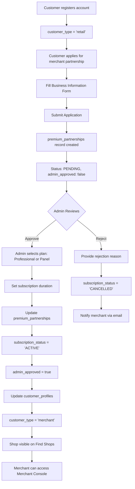
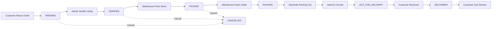

# AutoLab B2B E-Commerce Platform - Complete Documentation

**Version:** 2.0
**Last Updated:** December 2025
**Platform Type:** B2B Automotive Parts E-Commerce with Multi-Tier Merchant System

---

## Table of Contents

1. [System Overview](#system-overview)
2. [User Types & Roles](#user-types--roles)
3. [Database Architecture](#database-architecture)
4. [Core Features by User Type](#core-features-by-user-type)
5. [Merchant Subscription System](#merchant-subscription-system)
6. [Order Management Workflow](#order-management-workflow)
7. [2nd Hand Marketplace System](#2nd-hand-marketplace-system)
8. [Installation Guides Library](#installation-guides-library)
9. [Customer Tier System](#customer-tier-system)
10. [Notification System](#notification-system)
11. [Technical Stack](#technical-stack)
12. [API Endpoints & Routes](#api-endpoints--routes)

---

## 1. System Overview

AutoLab is a **B2B automotive parts e-commerce platform** designed for the Malaysian market. The platform connects:
- **Automotive parts suppliers** (AutoLab - Admin side)
- **Workshop owners, accessory shops, service centers** (Merchants/Resellers)
- **End customers** (Retail buyers)

### Key Business Model

1. **B2B Wholesale Pricing**: Merchants get special pricing on bulk orders
2. **Two-Tier Merchant System**:
   - **Professional Merchants** (RM99/year) - Basic merchant features
   - **Panel Partners** (RM350/month) - Top 100 authorized shops with premium features
3. **2nd Hand Marketplace**: Merchants can sell used/refurbished parts
4. **Installation Guides**: Video tutorials and pricing guides for authorized installers

---

## 2. User Types & Roles

### 2.1 Admin (AutoLab Staff)

**Access Level:** Full system control
**Authentication:** `admin_profiles` table
**Routes:** `/admin/*`

**Capabilities:**
- Product management (CRUD operations)
- Order processing and fulfillment
- Merchant approval and management
- Customer management
- Voucher and promotion creation
- Content management (installation guides, knowledge base)
- Analytics and reporting
- System settings

---

### 2.2 Merchant (Professional)

**Subscription:** RM99/year
**Authentication:** `customer_profiles.customer_type = 'merchant'` + `premium_partnerships.subscription_plan = 'professional'`
**Routes:** `/merchant-console`, `/my-2ndhand-listings`

**Capabilities:**

#### A. Shopping & Ordering
- Browse products with **B2B wholesale pricing**
- Place bulk orders with special merchant rates
- Order history and tracking
- RM50 Welcome Voucher (min spend RM100)

#### B. Business Management
- **Merchant Console Dashboard**
  - View shop performance metrics
  - Analytics: listing views, direction clicks, call clicks
  - Subscription status monitoring
- **Business Profile Management**
  - Shop name, category, description
  - Contact information
  - Location details
  - Services offered
  - Upload shop photos (storefront images)

#### C. Installation Guides Access
- Full access to installation guides library
- Video tutorials for automotive part installation
- Recommended pricing guidelines
- Step-by-step documentation
- Filter by car brand, model, year

#### D. 2nd Hand Marketplace
- **List used/refurbished parts for sale**
  - Upload up to 5 images per listing
  - Set selling price and original price
  - Specify condition (Like New, Good, Fair, Poor)
  - Product details (category, compatible vehicles)
  - Negotiable pricing option
- **Manage listings**
  - View all personal listings
  - Edit listing details
  - Delete listings
  - Track views and inquiries
- **Status tracking**
  - Pending admin approval
  - Active listings
  - Sold items

#### E. Subscription Management
- View current plan details
- Renewal dates and payment tracking
- Upgrade path to Panel tier (invitation-only)

---

### 2.3 Panel Partner (Premium Merchant)

**Subscription:** RM350/month (Invitation Only)
**Authentication:** `customer_profiles.customer_type = 'merchant'` + `premium_partnerships.subscription_plan = 'panel'`
**Limitation:** Maximum 100 slots nationwide
**Routes:** Same as Professional Merchant

**Everything from Professional Merchant, PLUS:**

#### Additional Benefits:
- **Featured Listing on Find Shops Page**
  - Priority placement in shop directory
  - Authorized Panel badge
  - Higher visibility to customers
- **Advanced Analytics Dashboard**
  - Detailed performance metrics
  - Customer engagement analytics
  - Revenue tracking
- **Priority Customer Support**
  - Dedicated support channel
  - Faster response times
- **Assigned Panel Slot Number**
  - Exclusive numbered positioning
  - Limited availability (1-100)
- **Premium Business Features**
  - `is_admin_invited = true`
  - `is_featured = true`
  - Higher `display_priority` value

---

### 2.4 Retail Customer

**Subscription:** Free
**Authentication:** `customer_profiles.customer_type = 'retail'`
**Routes:** Public routes + `/profile`, `/my-orders`

**Capabilities:**

#### A. Shopping
- Browse product catalog
- Search and filter products
- View product details and reviews
- Compare products
- **Pay retail prices** (higher than merchant pricing)
- Add to cart and checkout
- Apply vouchers and discounts

#### B. Account Management
- Create account and login
- Profile management
- Shipping addresses
- Order history
- Track order status

#### C. Interaction Features
- **Order History Access** (if granted by merchant)
  - View merchant's order recommendations
  - Access curated product history
- **Leave product reviews** (after purchase)
- **Browse 2nd Hand Marketplace**
  - View used parts listings
  - Contact sellers via inquiry system
  - No listing creation (view only)

#### D. Find Shops
- Browse authorized workshops/shops
- View shop details and services
- Get directions (Google Maps integration)
- Call shops directly
- View shop ratings and reviews

---

### 2.5 Guest (Unauthenticated)

**Access Level:** Public content only

**Capabilities:**
- Browse products (limited information)
- View shop directory (Find Shops page)
- Browse 2nd hand marketplace (view only)
- Access public content
- **Must register/login** for:
  - Viewing prices
  - Adding to cart
  - Placing orders
  - Contacting shops

---

## 3. Database Architecture

### Core Tables

#### 3.1 Authentication & Users

**`auth.users`** (Supabase Auth)
- Handles authentication
- Email/password management
- Session management

**`customer_profiles`**
```sql
- id (UUID, Primary Key)
- user_id (FK to auth.users)
- full_name
- phone
- customer_type (enum: 'retail', 'merchant')
- customer_tier_id (FK to customer_tiers)
- total_spending (for tier calculation)
- created_at, updated_at
```

**`admin_profiles`**
```sql
- id (UUID, Primary Key)
- user_id (FK to auth.users)
- full_name
- role (admin, staff, warehouse)
- permissions (JSONB)
```

---

#### 3.2 Products & Inventory

**`products_new`**
```sql
- id (UUID, Primary Key)
- name, description
- sku, barcode
- category, subcategory
- car_brand, car_model
- manufacturer_id (FK to manufacturers)
- manufacturer_brand
- price_retail (for retail customers)
- price_merchant (for merchants - B2B pricing)
- stock_quantity
- low_stock_threshold
- images (array)
- is_active, is_featured
- created_at, updated_at
```

**`manufacturers`**
```sql
- id (UUID, Primary Key)
- name (unique)
- description
- country
- logo_url, website_url
- is_active
- display_order
```

**`component_library`**
```sql
- id (UUID, Primary Key)
- component_type (e.g., "Coilover Suspension")
- name, description
- base_retail_price, base_merchant_price
- is_active
```

---

#### 3.3 Orders & Transactions

**`orders`**
```sql
- id (UUID, Primary Key)
- customer_id (FK to customer_profiles)
- order_number (e.g., "ORD-20250101-001")
- status (enum: 'pending', 'verified', 'picking', 'packing', 'out_for_delivery', 'delivered', 'cancelled')
- subtotal, tax, shipping_fee, discount, total_amount
- shipping_address (JSONB)
- payment_method, payment_status
- voucher_id (FK to vouchers)
- notes, admin_notes
- created_at, updated_at
```

**`order_items`**
```sql
- id (UUID, Primary Key)
- order_id (FK to orders)
- product_id (FK to products_new)
- quantity
- unit_price (captured at time of order)
- subtotal
```

---

#### 3.4 Merchant System

**`premium_partnerships`**
```sql
- id (UUID, Primary Key)
- merchant_id (FK to customer_profiles)
- business_name, business_registration_no, business_type
- contact_person, contact_phone, contact_email
- address, city, state, postcode
- latitude, longitude
- description
- services_offered (array)
- logo_url, cover_image_url, shop_photos (array)
- subscription_plan (enum: 'professional', 'panel')
- billing_cycle (enum: 'month', 'year')
- subscription_status (enum: 'PENDING', 'ACTIVE', 'SUSPENDED', 'CANCELLED', 'EXPIRED')
- subscription_start_date, subscription_end_date
- next_billing_date
- yearly_fee (99 for professional, 350 for panel)
- admin_approved (boolean)
- rejection_reason
- is_featured (boolean - panel only)
- display_priority (integer - panel only)
- panel_slot_number (1-100 for panel)
- is_admin_invited (boolean - panel only)
- total_views, total_clicks, total_inquiries
- created_at, updated_at
```

**`partnership_renewal_history`**
```sql
- id (UUID, Primary Key)
- partnership_id (FK to premium_partnerships)
- renewal_type (enum: 'NEW', 'RENEWAL', 'EXTENSION', 'UPGRADE', 'DOWNGRADE')
- previous_end_date, new_end_date
- months_extended
- amount_paid, payment_method, payment_reference
- previous_status, new_status
- admin_notes
- created_at
```

---

#### 3.5 Installation Guides

**`installation_guides`**
```sql
- id (UUID, Primary Key)
- title, description
- category (e.g., "Audio System", "Suspension")
- car_brand, car_model
- car_year_start, car_year_end
- video_url, thumbnail_url
- video_duration (e.g., "12:34")
- difficulty_level (enum: 'Easy', 'Medium', 'Hard', 'Expert')
- estimated_time_minutes
- recommended_retail_price (installation fee guidance)
- recommended_merchant_price
- tools_required (array)
- steps (JSONB - array of step objects)
- safety_notes (text)
- views_count
- is_published (boolean)
- created_at, updated_at
```

---

#### 3.6 2nd Hand Marketplace

**`secondhand_listings`**
```sql
- id (UUID, Primary Key)
- seller_id (FK to customer_profiles)
- title, description
- selling_price, original_price
- condition (enum: 'like_new', 'good', 'fair', 'poor')
- images (array of URLs, max 5)
- status (enum: 'pending', 'approved', 'rejected', 'sold', 'removed')
- product_category
- car_brand, car_model, compatible_years
- year_purchased, months_used
- reason_for_selling
- is_negotiable (boolean)
- views_count, inquiry_count
- admin_notes, rejection_reason
- created_at, updated_at
```

---

#### 3.7 Customer Tiers

**`customer_tiers`**
```sql
- id (UUID, Primary Key)
- tier_name (e.g., "Bronze", "Silver", "Gold", "Platinum")
- min_spending (threshold to reach tier)
- discount_percentage
- priority_support (boolean)
- free_shipping_threshold
- exclusive_products (boolean)
- birthday_bonus_percentage
- tier_color (hex color for UI)
- icon_url
- benefits (JSONB array)
- display_order
- is_active
```

---

#### 3.8 Notifications

**`notification_preferences`**
```sql
- id (UUID, Primary Key)
- user_id (FK to auth.users)
- order_updates (boolean)
- promotions (boolean)
- product_recommendations (boolean)
- new_arrivals (boolean)
- price_drops (boolean)
- back_in_stock (boolean)
- whatsapp_enabled (boolean)
- whatsapp_number
- created_at, updated_at
```

**`notification_logs`**
```sql
- id (UUID, Primary Key)
- user_id (FK to auth.users)
- notification_type (e.g., "order_status_change")
- title, message
- channel (enum: 'in_app', 'email', 'whatsapp')
- status (enum: 'pending', 'sent', 'failed', 'read')
- related_entity_type (e.g., "order")
- related_entity_id (UUID)
- sent_at, read_at
- created_at
```

---

#### 3.9 Order History Access

**`order_history_access`**
```sql
- id (UUID, Primary Key)
- merchant_id (FK to customer_profiles - merchant)
- customer_id (FK to customer_profiles - retail customer)
- access_type (enum: 'full', 'summary_only')
- granted_at
- expires_at (nullable)
- is_active (boolean)
- notes
- created_at
```

---

#### 3.10 Vouchers & Reviews

**`vouchers`**
```sql
- id (UUID, Primary Key)
- code (unique)
- description
- discount_type (enum: 'percentage', 'fixed_amount')
- discount_value
- min_purchase_amount
- max_discount_amount
- usage_limit, usage_count
- valid_from, valid_until
- applicable_to (enum: 'all', 'retail_only', 'merchant_only')
- is_active
```

**`product_reviews`**
```sql
- id (UUID, Primary Key)
- product_id (FK to products_new)
- customer_id (FK to customer_profiles)
- order_id (FK to orders - must have purchased)
- rating (1-5)
- review_text
- images (array)
- admin_response
- is_verified_purchase (boolean)
- status (enum: 'pending', 'approved', 'rejected')
- created_at, updated_at
```

---

## 4. Core Features by User Type

### 4.1 Admin Features

#### Dashboard (`/admin`)
- Revenue analytics
- Order statistics
- Product performance
- Customer acquisition metrics
- Merchant growth tracking

#### Product Management (`/admin/products-enhanced`)
**CRUD Operations:**
- Create new products with dual pricing (retail/merchant)
- Edit product details, images, specifications
- Manage stock levels
- Set low stock alerts
- Assign manufacturers
- Category management
- Bulk import/export

**Component Library** (`/admin/component-library`)
- Manage reusable product components (e.g., coilover types)
- Base pricing templates
- Quick product creation from components

#### Order Management (`/admin/orders`)
**Order Processing Flow:**
```
1. PENDING → Admin verifies order details
2. VERIFIED → Admin confirms order is valid
3. PICKING → Warehouse staff picks items
4. PACKING → Items are packed (Generate Packing List)
5. OUT_FOR_DELIVERY → Handed to courier
6. DELIVERED → Customer receives order
```

**Features:**
- Order verification (`/admin/order-verification`)
- Warehouse operations (`/admin/warehouse-operations`)
  - Picking tab: Pick items from inventory
  - Packing tab: Generate packing lists, pack orders
  - Shipping tab: Prepare for delivery
- Archive completed orders (`/admin/archived-orders`)
- Manual order status updates
- Add admin notes to orders
- Cancel orders with reason

#### Customer Management (`/admin/customers`)
- View all customers (retail + merchant)
- Customer profiles and order history
- Spending analytics
- Tier assignments
- Send targeted notifications

**Customer Tiers** (`/admin/customer-tiers`)
- Create/edit tier levels
- Set spending thresholds
- Configure tier benefits
- Discount percentages
- Automatic tier upgrades based on spending

#### Merchant Management (`/admin/premium-partners`)
**Partnership Approval Flow:**
```
1. Merchant applies (status: PENDING)
2. Admin reviews application
3. Admin approves/rejects
   - If APPROVED:
     • Select plan (Professional RM99/yr OR Panel RM350/mo)
     • Set subscription duration
     • Status → ACTIVE
     • Customer profile → customer_type = 'merchant'
     • Shop becomes visible on Find Shops
   - If REJECTED:
     • Provide rejection reason
     • Status → CANCELLED
```

**Management Actions:**
- Approve/reject applications
- Extend/renew subscriptions
- Change subscription plans
- Suspend/reactivate merchants
- Toggle featured status (Panel only)
- Assign panel slot numbers (1-100)
- Edit subscription details manually
- View renewal history
- Monitor merchant analytics (views, clicks)

#### 2nd Hand Marketplace Moderation (`/admin/secondhand-moderation`)
**Listing Moderation Flow:**
```
1. Merchant creates listing (status: PENDING)
2. Admin reviews listing
3. Admin approves/rejects
   - If APPROVED: status → ACTIVE (visible to public)
   - If REJECTED: provide reason, status → REJECTED
```

**Features:**
- View all 2nd hand listings
- Filter by status (pending, active, sold, rejected)
- View listing details (images, price, condition)
- Approve/reject with notes
- Monitor seller activity

#### Installation Guides Management (`/admin/installation-guides`)
**Content Management:**
- Create/edit installation guides
- Upload video content
- Set thumbnail images
- Specify compatible vehicles (brand, model, years)
- Define difficulty level
- Add step-by-step instructions
- Set recommended pricing (retail vs merchant installation fees)
- List required tools
- Safety notes and warnings
- Publish/unpublish guides

#### Voucher Management (`/admin/vouchers`)
- Create discount codes
- Set discount type (% or fixed amount)
- Define usage limits
- Set validity period
- Target specific user types
- Track usage statistics

#### Review Moderation (`/admin/review-moderation`)
- Approve/reject customer reviews
- Respond to reviews (admin response)
- Flag inappropriate content
- Verify purchase authenticity

#### Settings & Configuration (`/admin/settings`)
- General settings
- Payment gateway configuration
- Shipping rates
- Tax settings
- Email templates
- WhatsApp integration settings

---

### 4.2 Merchant Features (Professional & Panel)

#### Merchant Console Dashboard (`/merchant-console`)

**Tab: Dashboard**
- **Key Metrics:**
  - Listing views (shop profile views)
  - Direction clicks (Google Maps navigation)
  - Call clicks (phone number clicks)
  - Days remaining (subscription countdown)
- **Weekly Traffic Chart** (14-day view)
- **Subscription Status Banner**
  - Pending approval warning
  - Welcome voucher notification (RM50)
- **Business Summary Card**
  - Business name, category
  - Location
  - Services count
  - Photos uploaded count

**Tab: Business Profile**
- **Storefront Image**
  - Upload main shop photo
  - Displayed on Find Shops search results
  - Image gallery (multiple photos)
- **Basic Information**
  - Shop name
  - Category (dropdown: Auto Accessories Shop, Performance Workshop, etc.)
  - Introduction/bio
- **Contact & Location**
  - Phone number
  - Email address
  - Full address
  - City, state (dropdown)
- **Services Offered** (checkboxes)
  - Installation Service
  - Repair & Maintenance
  - Consultation
  - Product Sourcing
  - Warranty Service
  - Custom Orders
  - Delivery Available
  - Car Wash
- **Save Changes** button

**Tab: 2nd Hand Marketplace** (Redirects to `/my-2ndhand-listings`)

**Tab: Subscription**
- **Current Plan Display**
  - Plan name (Professional/Panel)
  - Status (Active/Pending)
  - Expiration date
- **Plan Comparison Cards**
  - Professional (RM99/year):
    - B2B Merchant Pricing
    - Basic Analytics Dashboard
    - Installation Guides Library
    - RM50 Welcome Voucher
    - ❌ No Find Shops listing
  - Panel (RM350/month):
    - Everything in Professional
    - ✅ Featured listing on Find Shops
    - ✅ Authorized Panel Badge
    - ✅ Priority support
    - ✅ Advanced Analytics
    - ⚠️ Invitation Only (Limited to 100)
- **FAQ Section**
  - How to subscribe
  - Welcome voucher details
  - Installation guides explanation
  - Panel tier requirements

**Tab: Installation Guides** (Professional & Panel only)
- **Search & Filter**
  - Search by title, car model
  - Filter by car brand (tabs)
- **Video Grid Display**
  - Thumbnail image
  - Play button overlay
  - Difficulty badge (Easy/Medium/Hard/Expert)
  - Duration label
  - Category tag
  - View count
  - Estimated time
- **Video Details**
  - Title
  - Compatible vehicles (brand, model, years)
  - Watch button (opens video URL)

#### 2nd Hand Marketplace (`/my-2ndhand-listings`)

**Create New Listing:**
- **Basic Information**
  - Title (product name)
  - Description
  - Product category
  - Selling price, original price
  - Condition (Like New/Good/Fair/Poor)
  - Negotiable checkbox
- **Vehicle Compatibility**
  - Car brand, car model
  - Compatible years
  - Year purchased, months used
- **Images**
  - Upload up to 5 images
  - Drag & drop or click to upload
  - Preview before submission
- **Reason for Selling** (text area)
- **Submit for Approval** button

**My Listings View:**
- **List all personal listings**
- **Status badges:**
  - 🟡 Pending (awaiting admin approval)
  - 🟢 Active (live on marketplace)
  - 🔴 Rejected (with rejection reason)
  - ⚪ Sold (marked as sold)
- **Listing Cards:**
  - Primary image
  - Title, price
  - Condition badge
  - Views count, inquiry count
  - Created date
- **Actions:**
  - Edit listing (if pending/active)
  - Delete listing
  - Mark as sold

#### Shopping as Merchant
- Browse products with **merchant pricing** displayed
- All prices show B2B wholesale rates (lower than retail)
- Standard checkout process
- Order tracking
- RM50 welcome voucher auto-applied on first qualifying order

---

### 4.3 Retail Customer Features

#### Product Browsing
- Browse catalog (shows **retail pricing**)
- Search products
- Filter by category, brand, price range
- View product details
- Read reviews from other customers

#### Shopping Cart & Checkout
- Add products to cart
- Apply voucher codes
- Select shipping address
- Choose payment method
- Complete checkout

#### My Account (`/profile`)
- View/edit profile
- Manage shipping addresses
- View order history
- Track order status

#### My Orders (`/my-orders`)
**Order History View:**
- List all orders
- Status tracking with progress indicator
- Order details (items, pricing, shipping)
- Delivery tracking
- **Leave review** (after delivery)

**Order Status Updates:**
- Pending → Verified → Picking → Packing → Out for Delivery → Delivered

#### Find Shops (`/find-shops`)
- Browse authorized merchants (Panel partners)
- Search by location, city
- Filter by services offered
- **Shop Cards Display:**
  - Shop logo/cover image
  - Business name
  - Category
  - Location (city, state)
  - Services offered tags
  - Contact: phone, directions button
  - Featured badge (Panel partners)
- Click for directions (Google Maps)
- Call shop directly

#### 2nd Hand Marketplace (`/secondhand-marketplace`)
- **View Active Listings**
- **Filter & Search:**
  - By category
  - By car brand/model
  - By condition
  - By price range
- **Listing Cards:**
  - Images carousel
  - Title, price (original price crossed out)
  - Condition badge
  - Compatible vehicles
  - Months used
  - Negotiable tag
- **Contact Seller** (inquiry system - future feature)

#### Product Reviews
- **Leave Review** (after purchase)
  - Rating (1-5 stars)
  - Review text
  - Upload photos
  - Submit for moderation
- **View Reviews** on product pages

#### Notification Settings (`/notification-settings`)
- **Preferences:**
  - Order updates
  - Promotions
  - Product recommendations
  - New arrivals
  - Price drops
  - Back in stock alerts
- **WhatsApp Integration:**
  - Enable/disable WhatsApp notifications
  - Set WhatsApp number

---

## 5. Merchant Subscription System

### 5.1 Subscription Plans

| Feature | Professional (Merchant) | Panel (Premium) |
|---------|------------------------|-----------------|
| **Price** | RM99/year | RM350/month |
| **Access Type** | Open to all | Invitation only |
| **Availability** | Unlimited | Limited to 100 slots |
| **B2B Pricing** | ✅ Yes | ✅ Yes |
| **Installation Guides** | ✅ Full Access | ✅ Full Access |
| **Analytics Dashboard** | ✅ Basic | ✅ Advanced |
| **Welcome Voucher** | ✅ RM50 | ✅ RM50 |
| **2nd Hand Marketplace** | ✅ Can list items | ✅ Can list items |
| **Find Shops Listing** | ❌ Not visible | ✅ Featured listing |
| **Authorized Badge** | ❌ No | ✅ Yes |
| **Priority Support** | ❌ Standard | ✅ Priority |
| **Panel Slot Number** | ❌ No | ✅ Assigned (1-100) |
| **Display Priority** | 0 | 100 |

### 5.2 Merchant Application Flow



### 5.3 Subscription Renewal Process

**Automatic Checks:**
- Cron job checks `subscription_end_date` daily
- When end date < 7 days: Send renewal reminder
- When end date passes:
  - Update `subscription_status = 'EXPIRED'`
  - Revoke merchant features
  - Shop removed from Find Shops

**Manual Renewal (Admin):**
1. Admin opens Premium Partners page
2. Finds expiring/expired merchant
3. Clicks "Extend" button
4. **Extension Modal:**
   - Current end date displayed
   - Select new plan (Professional/Panel)
   - Extension duration (12 or 24 months)
   - Amount paid
   - Payment method (Cash, Bank Transfer, Online, Cheque)
   - Payment reference
   - Admin notes
5. Submit extension
6. **Updates:**
   - New `subscription_end_date` calculated
   - `next_billing_date` updated
   - `subscription_status = 'ACTIVE'`
   - Record saved to `partnership_renewal_history`

**Renewal History Tracking:**
- View full renewal history per merchant
- Shows: renewal type, dates, amount paid, payment method, admin notes
- Audit trail for accounting

---

## 6. Order Management Workflow

### 6.1 Order Lifecycle



### 6.2 Admin Order Processing Steps

#### Step 1: Order Verification (`/admin/order-verification`)
**Purpose:** Validate order details before warehouse processing

**Actions:**
- Review customer information
- Verify shipping address
- Check payment confirmation
- Validate product availability
- Add admin notes if needed
- **Approve:** Status → VERIFIED
- **Cancel:** Status → CANCELLED (with reason)

#### Step 2: Warehouse Operations (`/admin/warehouse-operations`)

**PICKING Tab:**
- View all VERIFIED orders
- Display order items list
- Print picking list
- Warehouse staff collects items from inventory
- Mark items as picked
- **Action:** Status → PICKING

**PACKING Tab:**
- View all PICKING orders
- **Generate Packing List** (PDF)
  - Order number, customer details
  - Item list with SKU, quantity
  - Barcode/QR code
  - Special handling instructions
- Pack items in box
- Attach packing list
- **Action:** Status → PACKING

**SHIPPING Tab:**
- View all PACKING orders
- Arrange courier pickup
- Print shipping labels
- Record tracking number
- **Action:** Status → OUT_FOR_DELIVERY

#### Step 3: Delivery Confirmation
**Options:**
1. **Manual Update:**
   - Admin marks order as DELIVERED
2. **Courier Integration:**
   - Webhook from courier API
   - Auto-update status to DELIVERED
3. **Customer Confirmation:**
   - Customer confirms receipt
   - Status → DELIVERED

#### Step 4: Post-Delivery
- Customer can leave product reviews
- Order archived after 30 days (moved to `archived_orders`)
- Analytics updated

### 6.3 Order Status Tracking (Customer View)

**Customer sees progress:**
```
┌─────────────┐
│  PENDING    │  "Order placed, awaiting verification"
└─────────────┘
      ↓
┌─────────────┐
│  VERIFIED   │  "Order confirmed, preparing items"
└─────────────┘
      ↓
┌─────────────┐
│  PICKING    │  "Items being picked from warehouse"
└─────────────┘
      ↓
┌─────────────┐
│  PACKING    │  "Order being packed for shipment"
└─────────────┘
      ↓
┌─────────────┐
│OUT FOR      │  "On the way! Track: [tracking_number]"
│DELIVERY     │
└─────────────┘
      ↓
┌─────────────┐
│ DELIVERED   │  "Order completed ✓"
└─────────────┘
```

---

## 7. 2nd Hand Marketplace System

### 7.1 Listing Creation Flow (Merchant)

```
1. Merchant navigates to "2nd Hand Marketplace" tab
   ↓
2. Clicks "Create New Listing" button
   ↓
3. Fills out listing form:
   - Product title & description
   - Upload images (max 5)
   - Set selling price, original price
   - Select condition
   - Specify compatible vehicles
   - Reason for selling
   - Negotiable checkbox
   ↓
4. Submits listing
   ↓
5. System creates secondhand_listings record
   - status = 'pending'
   - seller_id = merchant's customer_profile id
   ↓
6. Merchant sees "Pending Approval" status
```

### 7.2 Admin Moderation Flow

```
1. Admin opens Secondhand Moderation page
   ↓
2. Views list of PENDING listings
   ↓
3. Clicks on listing to review
   ↓
4. Reviews:
   - Images (quality, appropriateness)
   - Product description (accuracy)
   - Pricing (reasonable?)
   - Condition stated
   ↓
5. Makes decision:

   APPROVE:
   - Status → 'approved'
   - Listing visible on marketplace
   - Merchant notified

   REJECT:
   - Status → 'rejected'
   - Provide rejection reason
   - Merchant notified with reason
   - Merchant can edit and resubmit
```

### 7.3 Public Marketplace View (All Users)

**URL:** `/secondhand-marketplace`

**Features:**
- Browse all APPROVED listings
- Search by keyword
- Filter by:
  - Category
  - Car brand/model
  - Condition
  - Price range
- Sort by:
  - Newest first
  - Price: Low to High
  - Price: High to Low

**Listing Display:**
- Image carousel (5 images)
- Title, selling price
- Original price (strikethrough)
- Savings calculation
- Condition badge (color-coded)
- Car compatibility
- Usage info (months used)
- Negotiable tag
- View count
- **Contact Seller** button

### 7.4 Inquiry System (Future Enhancement)

**Planned Features:**
- Customer can send inquiry to merchant
- Built-in messaging system
- Merchant receives notification
- Track inquiry count per listing
- Merchant can mark as sold

---

## 8. Installation Guides Library

### 8.1 Guide Structure

Each installation guide contains:

**Basic Info:**
- Title (e.g., "Installing Coilover Suspension - Honda Civic FK8")
- Category (Audio System, Suspension, Lighting, etc.)
- Car brand, model, year range

**Video Content:**
- Video URL (YouTube/Vimeo)
- Thumbnail image
- Duration (mm:ss)

**Difficulty:**
- Easy (⭐)
- Medium (⭐⭐)
- Hard (⭐⭐⭐)
- Expert (⭐⭐⭐⭐)

**Installation Details:**
- Estimated time (minutes)
- Required tools (array)
- Step-by-step instructions (JSONB)
  ```json
  [
    {
      "step_number": 1,
      "title": "Prepare the vehicle",
      "description": "Jack up the car and secure with jack stands",
      "image_url": "...",
      "safety_warning": "Never work under a car supported only by a jack"
    },
    ...
  ]
  ```
- Safety notes

**Pricing Guidance:**
- Recommended retail installation price
- Recommended merchant installation price
- Helps merchants price their services competitively

**Analytics:**
- View count
- Helps admin see which guides are most popular

### 8.2 Access Control

**Who Can Access:**
- ✅ **Professional Merchants** (RM99/year)
- ✅ **Panel Partners** (RM350/month)
- ❌ Retail Customers (not visible)
- ❌ Non-subscribed users

**Access Check:**
```typescript
const hasGuidesAccess =
  (partnership?.subscription_plan === 'professional' ||
   partnership?.subscription_plan === 'panel') &&
  partnership?.subscription_status === 'ACTIVE' &&
  partnership?.admin_approved;
```

### 8.3 Browse & Search

**Brand Tabs:**
- All Brands
- Toyota
- Honda
- Perodua
- Proton
- ... (dynamic from database)

**Search:**
- Search by title, model, category
- Real-time filtering

**Display Grid:**
- Thumbnail with play button
- Title
- Compatible vehicles
- Difficulty badge
- Duration
- View count
- Estimated time

**Click to Watch:**
- Opens video in new tab or embedded player

---

## 9. Customer Tier System

### 9.1 Tier Levels

Example tier structure:

| Tier | Min Spending | Discount | Benefits |
|------|-------------|----------|----------|
| **Bronze** | RM 0 | 0% | Standard service |
| **Silver** | RM 1,000 | 3% | Priority support, Free shipping >RM150 |
| **Gold** | RM 5,000 | 5% | All Silver + Birthday bonus 10% |
| **Platinum** | RM 15,000 | 8% | All Gold + Exclusive products |

### 9.2 Automatic Tier Upgrades

**Trigger:**
- `customer_profiles.total_spending` is updated on each completed order
- System checks if spending crosses tier threshold
- If yes, update `customer_tier_id`

**Workflow:**
```sql
-- On order completion
UPDATE customer_profiles
SET total_spending = total_spending + order.total_amount
WHERE id = order.customer_id;

-- Check tier eligibility
SELECT id FROM customer_tiers
WHERE min_spending <= (SELECT total_spending FROM customer_profiles WHERE id = ?)
ORDER BY min_spending DESC
LIMIT 1;

-- Update tier if changed
UPDATE customer_profiles
SET customer_tier_id = ?
WHERE id = ?;
```

### 9.3 Tier Benefits Application

**At Checkout:**
- System checks customer's tier
- Applies discount percentage automatically
- Calculates free shipping eligibility
- Shows tier benefits on order summary

**Birthday Bonus:**
- On customer's birthday month
- Additional discount percentage
- Requires birthday field in customer_profiles

---

## 10. Notification System

### 10.1 Notification Channels

**In-App Notifications:**
- Bell icon in header
- Notification badge (unread count)
- Notification panel with list
- Mark as read/unread
- Delete notifications

**Email Notifications:**
- Order confirmations
- Status updates
- Merchant approvals
- Account alerts

**WhatsApp Notifications:**
- Requires WhatsApp Business API integration
- Customer opts in via Notification Settings
- Provides WhatsApp number
- Receives order updates via WhatsApp

### 10.2 Notification Types

**Order Updates:**
- Order placed confirmation
- Order verified
- Order packed
- Out for delivery
- Delivered

**Merchant Alerts:**
- Application approved/rejected
- Subscription expiring soon (7 days)
- Subscription expired
- New 2nd hand listing inquiry

**Customer Alerts:**
- Promotion announcements
- New arrivals
- Price drops (watchlist)
- Back in stock alerts
- Review reminder (after delivery)

**Admin Alerts:**
- New orders pending verification
- Low stock alerts
- New merchant applications
- New 2nd hand listings pending moderation

### 10.3 Notification Preferences

**User Controls:**
- Enable/disable per category
- Choose channels (in-app, email, WhatsApp)
- Quiet hours (future feature)
- Frequency settings

**Settings Page:** `/notification-settings`

---

## 11. Technical Stack

### Frontend

**Framework:**
- React 18 with TypeScript
- Vite (build tool)

**Routing:**
- React Router v6

**UI Library:**
- Tailwind CSS (utility-first styling)
- shadcn/ui components (Dialog, Select, Button, etc.)
- Lucide React (icons)

**State Management:**
- React Hooks (useState, useEffect, useContext)
- Custom hooks (useAuth, useToast)

**API Client:**
- Supabase Client (JavaScript SDK)
- Real-time subscriptions

---

### Backend

**Database:**
- PostgreSQL (Supabase)
- Row Level Security (RLS) policies

**Authentication:**
- Supabase Auth
- JWT tokens
- Email/password authentication

**Storage:**
- Supabase Storage
- Buckets:
  - `product-images` (product photos)
  - `premium-partners` (shop photos, logos)
  - `secondhand` (2nd hand listing images)

**Real-time:**
- Supabase Realtime (WebSocket connections)
- Live updates on order status changes

---

### Deployment

**Hosting:**
- Frontend: Vercel / Netlify (recommended)
- Database: Supabase Cloud

**Environment Variables:**
```env
VITE_SUPABASE_URL=https://[project-id].supabase.co
VITE_SUPABASE_ANON_KEY=[anon-key]
```

---

## 12. API Endpoints & Routes

### Public Routes (No Auth Required)

```
GET  /                          # Home page
GET  /catalog                   # Product catalog
GET  /product/:id               # Product details
GET  /find-shops                # Browse shops
GET  /secondhand-marketplace    # Browse 2nd hand listings
GET  /auth                      # Login/Register page
```

### Customer Routes (Auth Required)

```
GET  /profile                   # Customer profile
GET  /my-orders                 # Order history
GET  /my-orders/:id             # Order details
POST /checkout                  # Place order
GET  /notification-settings     # Notification preferences
```

### Merchant Routes (Merchant Auth Required)

```
GET  /merchant-console          # Merchant dashboard
GET  /my-2ndhand-listings       # 2nd hand listings management
POST /my-2ndhand-listings       # Create new listing
PUT  /my-2ndhand-listings/:id   # Edit listing
DEL  /my-2ndhand-listings/:id   # Delete listing
```

### Admin Routes (Admin Auth Required)

```
GET  /admin                             # Admin dashboard
GET  /admin/products-enhanced           # Product management
GET  /admin/component-library           # Component library
GET  /admin/inventory-alerts            # Stock alerts
GET  /admin/orders                      # Order management
GET  /admin/order-verification          # Verify orders
GET  /admin/warehouse-operations        # Picking/packing
GET  /admin/archived-orders             # Archived orders
GET  /admin/customers                   # Customer management
GET  /admin/customer-tiers              # Tier management
GET  /admin/review-moderation           # Review moderation
GET  /admin/vouchers                    # Voucher management
GET  /admin/premium-partners            # Merchant management
GET  /admin/secondhand-moderation       # 2nd hand moderation
GET  /admin/installation-guides         # Guides management
GET  /admin/users                       # Staff management
GET  /admin/knowledge-base              # Knowledge base
GET  /admin/settings                    # System settings
```

---

## Appendix A: Database Schema Diagram

```
┌──────────────────┐
│   auth.users     │
│  (Supabase)      │
└────────┬─────────┘
         │
         ├─────────────────┬──────────────────┐
         │                 │                  │
┌────────▼─────────┐ ┌─────▼───────────┐ ┌──▼──────────────┐
│ customer_profiles│ │ admin_profiles  │ │notification_    │
│                  │ │                 │ │preferences      │
│ - customer_type  │ │ - role          │ └─────────────────┘
│ - customer_tier  │ │ - permissions   │
│ - total_spending │ └─────────────────┘
└────────┬─────────┘
         │
         ├──────────────┬───────────────┬──────────────┐
         │              │               │              │
┌────────▼─────────┐ ┌──▼────────────┐│         ┌────▼──────────┐
│ orders           │ │premium_       ││         │secondhand_    │
│                  │ │partnerships   ││         │listings       │
│ - status         │ │               ││         │               │
│ - total_amount   │ │ - merchant_id ││         │ - seller_id   │
└────────┬─────────┘ │ - plan        ││         │ - status      │
         │           │ - status      ││         └───────────────┘
    ┌────▼─────┐     └───────────────┘│
    │order_    │                       │
    │items     │            ┌──────────▼─────────┐
    └──────────┘            │partnership_renewal_│
                            │history             │
                            └────────────────────┘

┌──────────────────┐     ┌──────────────────┐
│ products_new     │     │ manufacturers    │
│                  │◄────│                  │
│ - manufacturer_id│     │ - name           │
│ - price_retail   │     │ - country        │
│ - price_merchant │     └──────────────────┘
└──────────────────┘

┌──────────────────┐     ┌──────────────────┐
│installation_     │     │customer_tiers    │
│guides            │     │                  │
│                  │     │ - min_spending   │
│ - car_brand      │     │ - discount       │
│ - video_url      │     └──────────────────┘
└──────────────────┘
```

---

## Appendix B: Key Enums & Constants

### Order Status
```typescript
type OrderStatus =
  | 'pending'
  | 'verified'
  | 'picking'
  | 'packing'
  | 'out_for_delivery'
  | 'delivered'
  | 'cancelled';
```

### Subscription Plans
```typescript
type SubscriptionPlan = 'professional' | 'panel';
```

### Subscription Status
```typescript
type SubscriptionStatus =
  | 'PENDING'
  | 'ACTIVE'
  | 'SUSPENDED'
  | 'CANCELLED'
  | 'EXPIRED';
```

### Customer Types
```typescript
type CustomerType = 'retail' | 'merchant';
```

### Listing Status (2nd Hand)
```typescript
type ListingStatus =
  | 'pending'
  | 'approved'
  | 'rejected'
  | 'sold'
  | 'removed';
```

### Product Condition
```typescript
type ProductCondition =
  | 'like_new'
  | 'good'
  | 'fair'
  | 'poor';
```

---

## Appendix C: SQL Migration Summary

### Phase 1 Migrations:
1. **Manufacturers Table** - Product manufacturer/factory brands
2. **Add Manufacturer Fields to Products** - Dual categorization
3. **Rename Enterprise to Panel** - Updated subscription tiers
4. **Add Billing Cycle** - Monthly vs yearly billing
5. **Panel-specific Columns** - `is_admin_invited`, `panel_slot_number`
6. **Installation Guides Enhancements** - Pricing, safety, tools

### Phase 2 Migrations:
7. **Notification System** - `notification_preferences`, `notification_logs`
8. **Order History Access** - Merchant-customer sharing
9. **2nd Hand Marketplace** - `secondhand_listings` table
10. **Customer Tiers** - Loyalty system
11. **Welcome Voucher Trigger** - Auto-generate on merchant approval

### Critical Fix:
- **customer_type Update on Approval** - Ensures merchants can access merchant features

---

## Appendix D: Important SQL Queries

### Fix Existing Merchants (One-time migration)
```sql
-- Update existing approved merchants to have customer_type = 'merchant'
UPDATE customer_profiles
SET
  customer_type = 'merchant',
  updated_at = NOW()
WHERE id IN (
  SELECT merchant_id
  FROM premium_partnerships
  WHERE admin_approved = true
    AND subscription_status = 'ACTIVE'
);
```

### Check Merchant Status
```sql
-- Verify a user is properly set up as merchant
SELECT
  cp.id,
  cp.customer_type,
  pp.subscription_plan,
  pp.subscription_status,
  pp.admin_approved
FROM customer_profiles cp
JOIN premium_partnerships pp ON pp.merchant_id = cp.id
WHERE cp.user_id = '[user-id]';
```

---

## Document Change Log

| Date | Version | Changes |
|------|---------|---------|
| Dec 2025 | 2.0 | Initial comprehensive documentation after Phase 1 & 2 implementation |

---

**End of Documentation**

For questions or updates, contact the development team.
