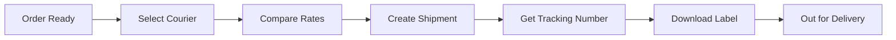

# Courier Service Integration Guide

This document explains the courier service integration implemented in the warehouse operations system.

## Overview

The system supports integration with multiple courier services for automated shipment creation and tracking:

- **J&T Express** - Nationwide parcel delivery service
- **Lalamove** - Same-day delivery and logistics
- **Own Delivery** - In-house delivery service

## Features

### 1. **Automated Shipment Creation**
- Select courier service when orders reach READY_FOR_DELIVERY status
- Compare rates from different courier providers
- Automatically create shipments via courier APIs
- Receive tracking numbers and shipping labels

### 2. **Real-time Tracking**
- Track shipment status in real-time
- View detailed shipment history
- Monitor current location and estimated delivery time
- Receive delivery confirmations

### 3. **Shipping Label Management**
- Download shipping labels automatically
- Print labels for package preparation
- QR code generation for easy scanning

## How It Works

### Shipment Creation Flow



### Step-by-Step Process

1. **Order reaches READY_FOR_DELIVERY status**
   - Warehouse staff pack the order
   - Order appears in "Ready" tab

2. **Create Shipment**
   - Click "Create Shipment" button
   - System shows order details and customer address
   - View available courier services with rates

3. **Select Courier**
   - J&T Express: RM 8.50 (3 days delivery)
   - Lalamove: RM 15.00 (Same day delivery)
   - Own Delivery: RM 5.00 (2 days delivery)

4. **Shipment Created**
   - System calls courier API
   - Receives tracking number and shipping label
   - Order status updated to OUT_FOR_DELIVERY
   - Courier information saved to database

5. **Track Shipment**
   - Click "Track" button to view real-time status
   - See shipment history and current location
   - Monitor estimated delivery time

6. **Download Label**
   - Click "Label" button to download/print shipping label
   - Label includes QR code for scanning
   - Attach label to package

## Current Implementation

### Mock API (Demo Mode)

Currently, the system uses **mock/simulated APIs** to demonstrate the flow:

```typescript
// Example: J&T Express Mock Response
{
  success: true,
  trackingNumber: "JNT1709876543210",
  shipmentId: "SHIP-JNT-1709876543",
  courierProvider: "JNT",
  estimatedDeliveryDate: "2025-10-11",
  shippingLabel: "/api/mock/labels/jnt/JNT1709876543210",
  cost: 8.50
}
```

### Database Schema

The following fields are added to the `orders` table:

```sql
-- Courier-related columns
courier_provider VARCHAR(50)           -- 'JNT', 'LALAMOVE', or 'OWN_DELIVERY'
courier_tracking_number VARCHAR(255)   -- Tracking number from courier
courier_shipment_id VARCHAR(255)       -- Shipment ID from courier
courier_cost DECIMAL(10,2)             -- Shipping cost
courier_label_url TEXT                 -- URL to shipping label
courier_created_at TIMESTAMP           -- When shipment was created
```

## Integration with Real APIs

To integrate with real courier APIs, replace the mock implementations in `src/lib/courier-service.ts`:

### 1. J&T Express Integration

```typescript
// File: src/lib/courier-service.ts
// Replace the mock implementation in JNTExpressService.createShipment()

async createShipment(request: ShipmentRequest): Promise<ShipmentResponse> {
  try {
    const response = await fetch(`${this.apiEndpoint}/shipments`, {
      method: 'POST',
      headers: {
        'Content-Type': 'application/json',
        'Authorization': `Bearer ${this.apiKey}`,
        'API-KEY': this.apiKey
      },
      body: JSON.stringify({
        sender: request.pickupAddress,
        receiver: {
          name: request.customerName,
          phone: request.customerPhone,
          address: request.deliveryAddress.address,
          city: request.deliveryAddress.city,
          postcode: request.deliveryAddress.postcode,
          state: request.deliveryAddress.state
        },
        parcel: {
          items: request.items,
          weight: request.totalWeight,
          declared_value: request.totalValue
        },
        service_type: request.serviceType || 'standard'
      })
    });

    const data = await response.json();

    return {
      success: true,
      trackingNumber: data.tracking_number,
      shipmentId: data.shipment_id,
      courierProvider: 'JNT',
      estimatedDeliveryDate: data.estimated_delivery_date,
      shippingLabel: data.label_url,
      cost: data.shipping_cost
    };
  } catch (error: any) {
    return {
      success: false,
      courierProvider: 'JNT',
      errorMessage: error.message
    };
  }
}
```

### 2. Lalamove Integration

```typescript
// File: src/lib/courier-service.ts
// Replace the mock implementation in LalamoveService.createShipment()

async createShipment(request: ShipmentRequest): Promise<ShipmentResponse> {
  try {
    const response = await fetch(`${this.apiEndpoint}/orders`, {
      method: 'POST',
      headers: {
        'Content-Type': 'application/json',
        'Authorization': `Bearer ${this.apiKey}`,
        'X-LLM-Country': 'MY'
      },
      body: JSON.stringify({
        serviceType: 'MOTORCYCLE', // or 'CAR', 'VAN', 'TRUCK'
        stops: [
          {
            location: {
              address: request.pickupAddress?.address,
              coordinates: { lat: '3.1390', lng: '101.6869' }
            },
            contactName: request.pickupAddress?.contactName,
            contactPhone: request.pickupAddress?.contactPhone
          },
          {
            location: {
              address: request.deliveryAddress.address,
              coordinates: { lat: '3.1390', lng: '101.6869' }
            },
            contactName: request.customerName,
            contactPhone: request.customerPhone
          }
        ],
        deliveryType: 'NOW', // or 'SCHEDULED'
        item: {
          quantity: request.items.reduce((sum, item) => sum + item.quantity, 0),
          weight: request.totalWeight,
          description: request.items.map(i => i.name).join(', ')
        }
      })
    });

    const data = await response.json();

    return {
      success: true,
      trackingNumber: data.orderId,
      shipmentId: data.orderId,
      courierProvider: 'LALAMOVE',
      estimatedDeliveryDate: data.estimatedDeliveryTime,
      cost: data.priceBreakdown.total
    };
  } catch (error: any) {
    return {
      success: false,
      courierProvider: 'LALAMOVE',
      errorMessage: error.message
    };
  }
}
```

### 3. Configuration

Update courier service configuration with real API credentials:

```typescript
// File: src/lib/courier-service.ts

export const COURIER_SERVICES: CourierService[] = [
  {
    id: 'JNT',
    name: 'J&T Express',
    description: 'Fast and reliable nationwide delivery',
    enabled: true,
    apiEndpoint: 'https://api.jtexpress.my/v1',  // Real API endpoint
    apiKey: process.env.JNT_API_KEY               // From environment variables
  },
  {
    id: 'LALAMOVE',
    name: 'Lalamove',
    description: 'Same-day delivery service',
    enabled: true,
    apiEndpoint: 'https://api.lalamove.com/v2',   // Real API endpoint
    apiKey: process.env.LALAMOVE_API_KEY          // From environment variables
  },
  {
    id: 'OWN_DELIVERY',
    name: 'Own Delivery',
    description: 'In-house delivery service',
    enabled: true
  }
];
```

### 4. Environment Variables

Create a `.env` file with your API credentials:

```env
# J&T Express API Credentials
JNT_API_KEY=your_jnt_api_key_here
JNT_API_ENDPOINT=https://api.jtexpress.my/v1

# Lalamove API Credentials
LALAMOVE_API_KEY=your_lalamove_api_key_here
LALAMOVE_API_SECRET=your_lalamove_api_secret_here
LALAMOVE_API_ENDPOINT=https://api.lalamove.com/v2
```

## API Documentation Links

### J&T Express
- Official API Docs: https://www.jtexpress.my/api-docs
- Developer Portal: https://developer.jtexpress.my
- API Registration: Contact J&T Express sales team

### Lalamove
- Official API Docs: https://developers.lalamove.com/
- API Console: https://www.lalamove.com/api
- Sandbox Environment: Available for testing

## Testing

### Test the Integration

1. **Create a test order** in the system
2. **Move order to READY_FOR_DELIVERY** status
3. **Click "Create Shipment"** button
4. **Select a courier** service (currently uses mock data)
5. **Verify tracking number** is generated
6. **Click "Track"** to view shipment status
7. **Click "Label"** to download shipping label

### Expected Behavior

- ✅ Courier selection dialog opens with rates
- ✅ Shipment creates successfully
- ✅ Tracking number appears in order details
- ✅ Track button shows real-time status
- ✅ Label button downloads/opens shipping label
- ✅ Order status updates to OUT_FOR_DELIVERY

## Webhook Integration (Optional)

For automatic status updates from couriers, implement webhook endpoints:

```typescript
// Example webhook handler
app.post('/api/webhooks/jnt', async (req, res) => {
  const { tracking_number, status, location, timestamp } = req.body;

  // Update order status based on courier webhook
  await supabase
    .from('orders')
    .update({
      status: mapCourierStatusToOrderStatus(status),
      updated_at: new Date().toISOString()
    })
    .eq('courier_tracking_number', tracking_number);

  res.json({ success: true });
});
```

## Support

For questions or issues with courier integration:

1. Check API documentation links above
2. Review mock implementations in `src/lib/courier-service.ts`
3. Test with demo data first before real API integration
4. Contact courier service providers for API access

## Future Enhancements

- [ ] Bulk shipment creation for multiple orders
- [ ] Automated label printing
- [ ] Delivery performance analytics
- [ ] Cost comparison dashboard
- [ ] Customer notification via SMS/Email
- [ ] Return shipment handling
- [ ] International shipping support
